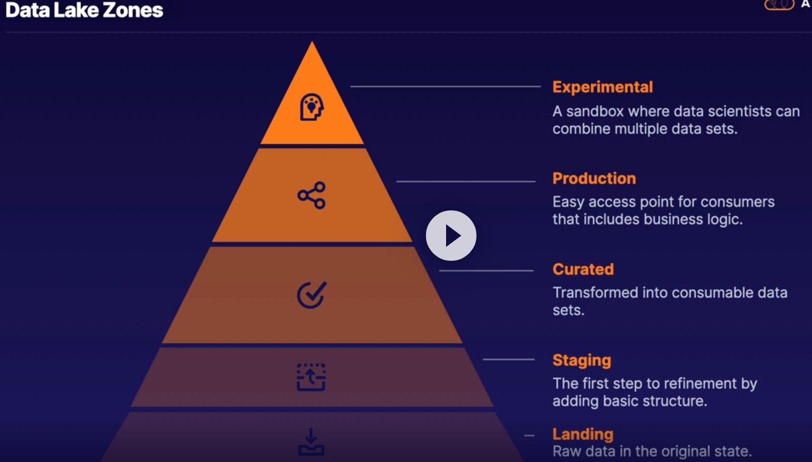
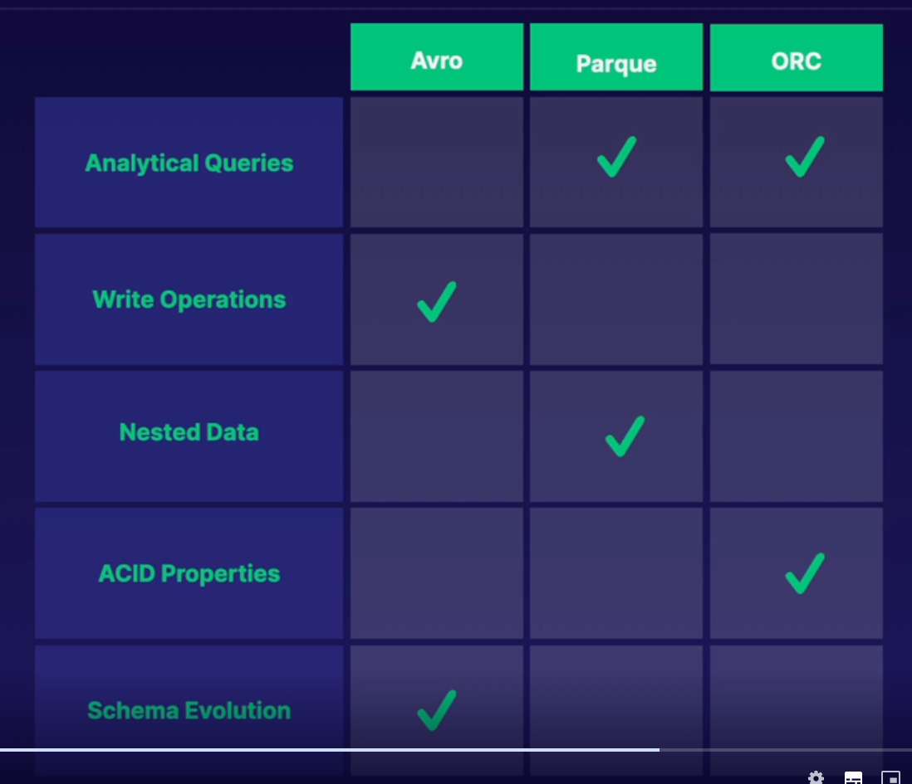
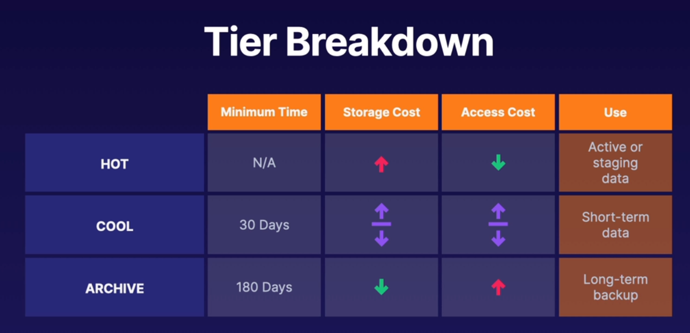
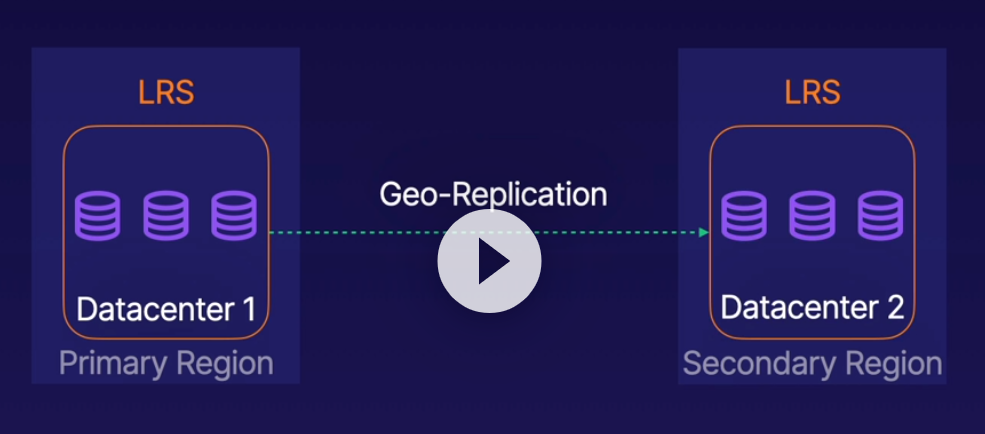
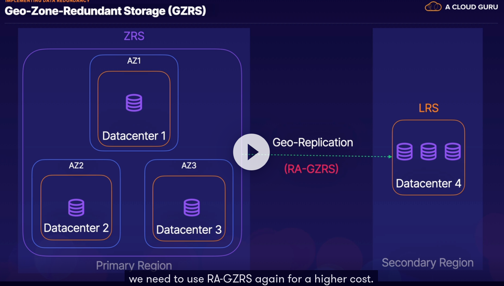
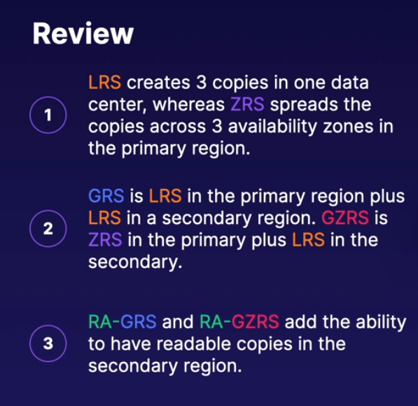
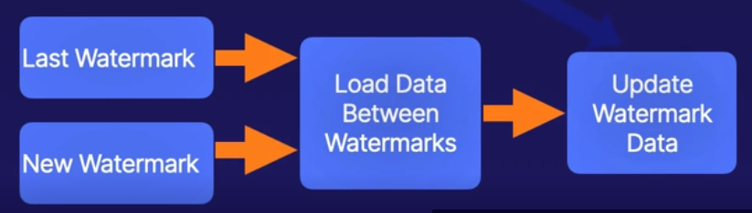
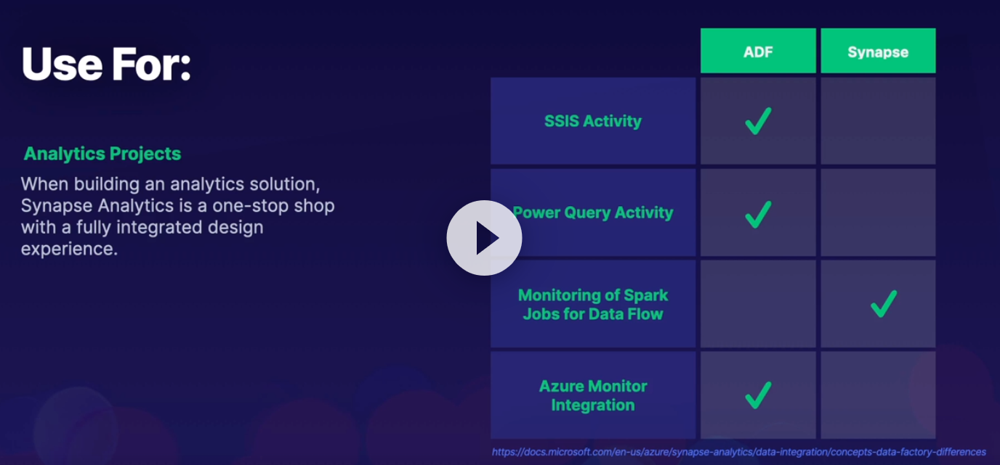
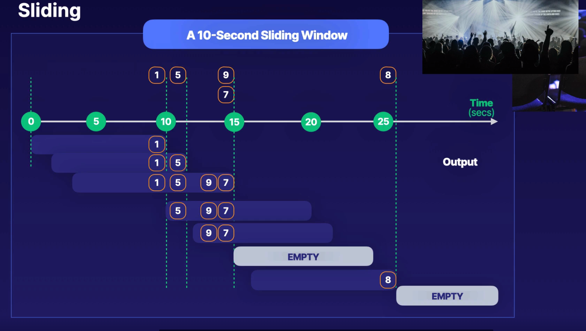
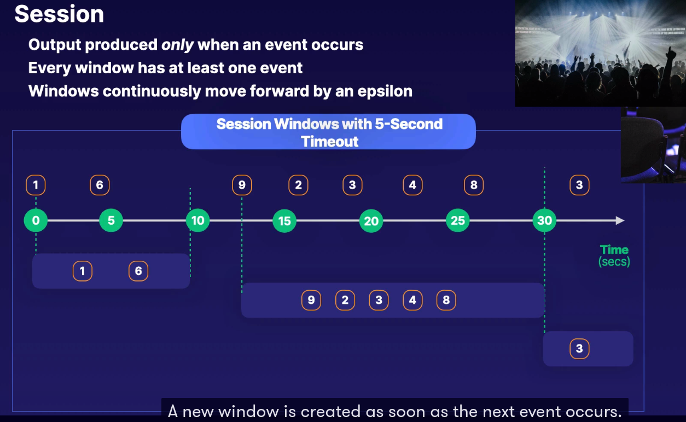

# Azure Data Engineer Associate Certifications

[Certification Link](https://learn.microsoft.com/en-us/certifications/azure-data-engineer/)

[Study Guide](https://query.prod.cms.rt.microsoft.com/cms/api/am/binary/RE4MbYT)

[Pratical Test](https://in.mindhub.com/dp-203-data-engineering-on-microsoft-azure-microsoft-official-practice-test/p/MU-DP-203?utm_source=microsoft&utm_medium=certpage&utm_campaign=msofficialpractice)

[Microsoft Learning Paths](https://learn.microsoft.com/en-us/certifications/exams/DP-203)

## Data Lake Storage Gen2

### Folder Strategy

{ loading=lazy }

{ loading=lazy }

### Partitioning

* Partition Key
    * The partition key consists of the full blob name (account + container + blob)
* Range-Based Partitioning
    * The data is split into ranges, which are load-balanced across the storage system
* Performance
    * Name with Care
      * Consider using a hashing function to prefix names with a 3-digit hash
    * Embrace Pruning
    * Keeping partition sizes smaller will help keep query response times lower
* Scalability
    * Plan for the Future
      * Estimate size and workload of each partition with an aim toward balance
    * Stay withing the limits
      * Careful to not exceed the single partition store limits
* Availability Considerations
    * Prioritize by Partition
      * Apply availability and backup plans according to a partitions level of criticalness
    * Be mindful of time
      * Know the best times for partitions to be taken offline for maintenance, and keep them small to ensure efficient execution of those tasks

### Archiving Data

* Storage limits are set at the account level not per access tier

{ loading=lazy }

* Hot
    * Optimized for frequently accessed data
    * Can be set in account level
* Cool
    * Optimized for infrequently accessed data that's stored for about a month
    * Can be set in account level
    * Slightly lower availability compared to hot
    * Early deletion penalty (Minimum 30 days)
* Archive
    * Optimized for data that is rarely accessed
    * Only Blob Level
    * Early deletion penalty (Minimum 180 days)
    * Stored offline
    * Only Supports LRS and GRS and RA_GRS

### Data Redundancy

{ loading=lazy }

{ loading=lazy }

{ loading=lazy }

{ loading=lazy }

## Data Factory

### Activities

* Native Data Flows (Activities executed in Azure Databricks or Azure HDInsight)
    * Mapping data flow
      * Visually designed data transformations that don't require writing code
    * Data wrangling
      * Utilizes Power Query to accomplish code-free data preparation at cloud scale
* External Transformations (Can bring your compute such HDInsightCluster)
    * HDInsight Hive/pig/Map reduce/streaming
    * HDInsight spark Activity
      * Allows to execute Spark programs on either your own or on-demand HDInsight Cluster
      * Can provide multiple dependencies such as jar packages, python scripts and any other files
      * sparkJobLinkedService
          * Only Blob Storage and ADLS Gen2
      * getDebugInfo
          * None, Always, or Failure (default is none)
    * ML Studio (classic) Activities
    * Stored Procedure
    * Data Lake Analytics U-SQL Activity
    * Azure Synapse Notebook Activity
    * Databricks Notebook/Jar/Python Activity
    * Custom .NET activity
* Cleansing Data
    * Clean Missing Data Module
      * When working in Azure Machine Learning, this module allows you to replace, remove, and even infer values
    * Mapping Data Flows
      * As part of Azure Data Factory, these activities allow you to include data cleansing as part of your pipeline
* Splliting Data
    * The new branch transformation will allow you to split one source into multiple streams
    * The conditional split transformation will allow you to direct a subset of data into a new stream
    * These transformations are available in bot Azure Data Factory and Azure synapse pipeline
* Encoding
    * Copy Activity
        * Set encoding options on the dataset properties for your source and sink
    * Azure Function
        * For complex scenarios, insert an Azure function activity into the pipeline
* Normalizing and Denormalizing
    * Use mapping data flows in Azure data factory or modules in azure machine learning to accomplish this
* Data Exploratory
    * Azure data Explorer allows you to perform real-time analysis on large volumes of data
    * Kusto queries are the method by which you interact with and explore the data
* Incremental Loads (Use Watermark)
    * The Process
        * 1) Create 2 Lookup Activities
        * 2) Create Copy Activity
        * 3) Create a Stored Procedure Activity to update the watermark

{ loading=lazy }

* Exception Handling
    * Success
    * Failure
    * Completion
    * Skipped
    * Fault Tolerance
        * What errors can we ignore
    * Retry
        * Defining retry attempts and time limits
* Partition Types
    * Round Robin
    * Hash
    * Dynamic Range
    * Fixed Range
    * Key

### Data Flow

* Code Free transformation tool in data factory
* Useful in
    * Duplicate data, missing data, etc
* Why not use?
    * Need more complexity
    * Lighter still with Power BI

* Upserting Data
    * Select Data Flow
    * Start with the Source
    * Choose AlterRow
    * Create Upsert if conditions
    * Finish with the Destination

### Error Handling (On Sink)

* Continue on Error
  * Transaction commit
    * Choose whether to write data in a single transaction or in batches
  * Output Rejected Data
    * Log the error rows to CSV in Azure Storage, including the SQL operation and error information
  * Success on Error
    * Mark the data flow as successful even if errors occur
* Conditional Split (For those times that you need to go beyond the automated catch-all, good to mitigate know situations)
  * Custom Logic
    * Use specialized conditions to route bad rows to logging, and then continue on sucessfully

### Trigger Pipelines

* Manual Execution
    * On-demand Execution
    * 4 Methods for configuring
       * .NET | PowerShell | REST | Python | Portal
* Schedule
* Tumbling Window
    * Fixed
    * Non-Overlapping
    * Contiguous Time Intervals
* Event Based
    * Storage Events

### Monitoring Data Pipelines

* Dashboards
* Runs
* Runtime & Sessions
    * Compute Infra used by Data Factory and Synapse pipelines
    * Types
        * Self-Hosted
        * Azure
        * Azure-SSIS
    * Data Flow Debug
* Notifications
    * Alerts and Metrics
* Data Factory stores pipeline-run data for only 45 days. Use Azure Monitor if you want to keep that data for a longer time.

## Azure Synapse

[Capability Matrix](https://learn.microsoft.com/en-us/azure/architecture/data-guide/technology-choices/data-storage#file-storage-capabilities)

### Partitioning

* The data is automatically distributed across 60 underlying databases (distributions)
* Scope queries to as few partitions as possible. Avoid cross-partition joins or transactions
* Utilize Partition Operations
    * Use partition switching, merging, and deletion instead of traditional inserts, updates or deletes
* Don't over partition
    * Generally, you want 10s or 100s of partitions, not 1000s. Each scenario will be different
      
* When creating partitions on clustered columnstore tables, it is important to consider how many rows belong to each partition.
     * For optimal compression and performance of clustered columnstore tables, a minimum of 1 million rows per distribution and partition is needed.
     * Before partitions are created, dedicated SQL pool already divides each table into 60 distributed databases.

### Distribution (Dedicated SQL Pool)

* Round-Robin
    * Even Distribution Across Databases
    * Fast performance for loads
    * Slower performance for Reads
    * Best For:
      * When there is no clear distribution key
      * You dont have frequent joins with other tables
      * Uniform distribution is desired
      * Temporary stating table
      * You just need a simple starting point
* Hash
    * Distribution is Deterministic
      * Data is distributed by the hash value of a column
    * The Distribution Column cannot be changed
    * Try to minimize data movement while also distributing evenly
    * Distribution Column Should:
      * Has many unique values
      * Has few or no NULLs
      * Is not a date column
      * chose a distribution column which: “Is not used in WHERE clauses. This could narrow the query to not run on all the distributions.“
    * Best For
      * Large Tables (2 Gigas)
      * Tables with frequent inserts, updates, and deletes

* Replicated
    * Full table on Every Node
      * Eliminates the need to transfer this data for queries
    * Storage Impact
      * This option requires extra storage and incurs overhead for writes
    * One piece of the puzzle
      * Replication is normally used in conjunction with other methods
    * Best For
      * Small lookup or dimension tables that are frequently joined with larger tables

### Compressing Data

* Columnstore
    * Types
      * Columnstore compression (on by default)
      * Columnstore Archival compression
    * Used on Columnstore objects
      * Columnstore table or clustered index
      * Nonclustered columnstore index
    * Considerations
      * Indexes with columnstore archival compression are slower than those without it
      * Use only to reduce the storage size of data is not accessd frequently

### Table Schemas

* Snowflake Schema
  * High Cardinality
    * Very Little repetition
    * Normalized
  * Best for Complex queries
  * Less Storage space

### External Tables

* Tables whose data comes from files stored outside of database
    * Not for frequently accessed tables
* When you need to access data without needing to copy the entire dataset
    * Provides fast ad-hoc data access to data hosted outside the bounds of your database
* Use Kusto schema for Azure Blob Storage or Azure Data Lake
    * They can also be created in Azure Synapse

### UDF

* Types
    * Scalar Functions
        * Return a single data value
        * Can be a single or multi-statement function
    * Table-valued function
        * Table valued functions return a table data type
    * System Function (Built-In Functions)

### Azure Synapse Pipelines

{ loading=lazy }

### Configuring Security and Compliance

* Data Protection
* Data Masking Types
    * Default
        * Full Masking
    * Credit Card
        * All but last 4
    * Email
        * First letter and .com
    * Random Number
        * Generate a random number
    * Custom
        * Custom padding string
* Auditing Data
    * Feature in Synapse and SQL DB
    * Can Store the Audit Log in:
        * Storage Account
        * Log Analytics
        * Event Hub
* Synapse Data Retention
    * Configurable from 1 day to 9 years

* Data Purge
    * Reasons
        * Outdated
        * Errors
        * Duplicate Data
        * Regulatory

    * You need a data retention policy
        * Including lifetime regulatory requirements
    * Data should move from active to archive to purge
    * Look at Standard Application Storage and backup
        * Standard backups may cause regulatory issues

### Monitoring

[Link To Create Statistics](https://learn.microsoft.com/en-us/azure/synapse-analytics/sql/develop-tables-statistics#examples-create-statistics)

* Azure Synapse Statistics
    * Automatic Creation of Statistics
       * Need turn on: Verify

```sql
SELECT name, is_auto_create_stats_on
FROM sys.databases
```
   * To turn on
```sql
ALTER DATABASE <tourstuffhere>
SET AUTO_CREATE_STATISTICS ON
```

* Statistics on
    * SELECT
    * INSERT-SELECT
    * CTAS
    * UPDATE
    * DELETE
    * EXPLAIN


* Synapse Query Performance

    * Query Store
       * Provides insight on your query plan choice and performance
       * Captures queries, plans, and runtime statisticas
       * To turn on

```sql
ALTER DATABASE <database_name>
SET QUERY_STORE = on;
```

* 3 Stores
    * Plan Store
    * Runtime Stats Store
    * Wait Stats Store
* 30 Days of Data
* Limited Analysis compared to DMVs

* Dynamic Management Views
     * Views
        * dm_pdw_nodes_tran_database_transactions
            * If your queries are failing or taking a long time to proceed, you can check and monitor if you have any transactions rolling back.
     * SQL Server, Power BI, etc....
     * Query give information about model operations, etc...
     * Extensive option for analysis
     * Limited to 10000 queries
     * Not as easy for large scale operations
* Log Analytics
    * Great Log Retention
    * KUSTO language
* Azure Data Explorer
    * Extensive option for analysis
    * Kusto Language
    * Expensive than alternatives

### Tunning Queries by using Cache

* SQL pool auto-caches query results in a user database for repeat use
* Must turn on set caching
    * user database
    * session
* What is not cached
    * UDF
    * Row / column security
    * Rows larger than 64KB / Total data over 10GB
    * Built-in functions or runtime that isn't deterministic
* To Turn On
    * SET RESULT_SET_CACHING { ON | OFF }

* Cache Management
    * When cache results can be reused
        * The user has access to all tables
        * There is an exact match between old / new query
        * There are no schema changes
    * Cache is dumped
        * Every 48 hours if the result set isn't used
        * When cache approaches 1 TB /database

## Azure Databricks

### Pruning Data (Databricks)

* Configurations
    * spark.databricks.optimizer.dynamicPartitionPruning
      * Default: True
    * spark.databricks.optimizer.deltaTableSizeThreshold
      * Default: 10,000,000,000 bytes (10GB)
    * spark.databricks.optimizer.deltaTableFilesThreshold
      * Default: 10 (Databricks runtime 8.4 and above)
* Review
    * Delta Lake on databricks utilizes metadata to power data skipping
    * Z-Ordering colocates related information in the same set of files, pre-sorting your data
    * Dynamic File pruning utilizes these technologies to skip files within a partition based on filters

### Metastores

* Cluster Configuration
    * Can be Synapse or Databricks
    * Main Configuration Points
        * Metastore Version and Jar
        * Connection to external metastore
    * Steps
        * Create Cluster
        * Find Location of Jars
        * Run Command
            * %sh cp -r <path> /dbfs/hive_metastore_jar
        * Create Init Script to copy jars
        * Set spark.sql.hive.metastore.jars to use the <path> (to use new path)
     * Connection to external metastore
        * JDBC connect string
            * javax.jdo.option.ConnectionURL <mssql-connection-string>
        * Username
            * javax.jdo.option.ConnectionUserName <mssql-username>
        * Password
            * javax.jdo.option.ConnectionPassword <mssql-password>
        * Driver Class
           * javax.jdo.option.ConnectionDriverName com.microsoft.sqlserver.jdbc.SQL.ServerDriver

* Maintain Metadata in Data Factory
     * When using the copy activity, select preserve attributes using a binary source dataset.

### Spark Structure Streaming

* Inputs
    * TCP Socket => For debug
    * Message Source
        * Kafka
        * Event Hubs
    * File Sources
        * Data Lake Store
       * Storage Blobs
* Stream Processed
     * Structured Streaming On HDInsight
* Sinks
    * Custom Sinks
        * Power BI Dashboards
        * Databases
    * Debug Sinks
        * Console Sinks
        * In-Memory table Sink
    * File Sinks
        * Data Lake Store
       * Azure Storage Blobs
* Modes for Table Outputs
     * Complete Mode
        * Complete rewrite
        * Use Windowing
     * Append Mode
        * Only new rows
     * Update Mode
        * Basically, same as append Queries with aggregations

### Resource Tokens

* Two Ways to authenticate
    * Azure AD Access Tokens
    * Azure Databricks personal access tokens

### Logging

* Cluster event logs
    * capture cluster lifecycle events, like creation, termination, configuration edits, and so on.
* Apache Spark  driver and worker logs
* Cluster init-script log
    * valuable for debugging init scripts
* Workspace Logs
    * Workspace Logs level audit log
    * Change Password, Create Group, Delete Group, generateDbToken...

* To collect application Log messages
    * Library: Azure Databricks Monitoring Library
    * Workspace: Azure Log Analytics

### Auto Optimize

* Allows you to auto compact small files
    * Individual writes to delta table
* Turn On
    * Need enable optimized writes and Auto compaction
    * On Create Table
        * delta.autoOptimize.optimizeWrite = true
        * delta.autoOptimize.autoCompact = true
* Should i always enable Auto Compaction
    * Depends on latency
    * It depends on concurrent operations
        * DELETE, MERGE, etc => Not good for auto optimize
* Very helpful when queries are important and latency isn't

### Shuffling on Spark

* Mechanism for repartition data
* Shuffling is triggered for transformation operations
    * Groupby(), join(), union(), etc
* Shuffling is an expensive operation
    * Requires disk I/O and network i/o
    * Data serialization and deserialization
* Setting the shuffle partition size
    * Use Adaptive Query Execution (AQE)
        * Set initial the shuffle partition number

### Loading a DataFrame with Sensitive Information with Azure Vault

1. Add a Blob Storage and Generate a SAS Token
2. Configure a secret to store your SAS Token
3. Link Azure Databricks to the Key Vault
4. Mount the Blob Container using SAS Token and using Azure Key Vault
5. Alternative: Uses SAS to Directly write without mounting

### Troubleshooting a Failed Spark Job

* Examine the Log Files
    * Check stderr and syslog files
    * Check hadoop step logs
* Configuration Settings
    * Cluster Settings
    * Hardware configuration
    * Nodes
* Reproduce the Error
    * If all else fails, try again on a new cluster
* Can use Spark UI
    * To understand shuffle optimization
    * Can access to
        * Jobs
        * Executors
        * Stages
        * Queries

### Clusters

* Data Engineers 
    * High Concurrency cluster as it provides for sharing . Also caters for SQL, Python and R.
    * High-concurrency clusters do not support Scala.
* Data Scientist 
    * Standard Clusters which automatically terminates after 120 minutes and caters for Scala, SQL, Python and R.
* JOBS 
    * Standard Cluster

## Azure SQL

### Compressing Data

* RowStore
  * Types
    * Row Compression
    * Page Compression
      * Includes Row compression and looks for patterns in data and makes replacements with smaller values
      * Is less useful if don't have duplicates in data
  * Storage Savings, Improved I/O Performance
  * Used on Rowstore objects
    * Heap table
    * Clustered Index
    * Nonclustered Index
    * Indexed view
  * Available in Azure SQL Database, but not every SQL Server Edition
  * Maximum Row size plus compression overhead cannot exceed 8060 bytes
  * ROW or PAGE compression can be enabled both online or offline
  * Disk space requirements when enabling or disabling are the same as when you are creating or rebuilding an index

### Sharding Data

* The lookup Strategy
    * The Sharding logic uses a map to route requests to the appropriate shard based on the shard key
* The Range Strategy
    * Related items are grouped together in the same shard and ordered sequentially by the shard key
    * Works well with range queries (like all orders for december)
    * May be not balance
* The Hash Strategy
    * A hash of one or more attributes is used to determine the shard in which an item will be placed
    * Achieve Balance. Spread data evenly
    * Columnstore tables won‘t benefit a query unless the table has more than 60 million rows

* Considerations
    * Large number of small shards than small number of large shards
    * Usa stable data for the shard key. If it changes often, then you could incur performance penalties as the system does more work

### Clean Data

* Data Quality Services (DQS)
  * A component of SQL Server that allows for computer-assisted data cleansing

## Azure Streams Analytics

* Sources
    * Event Hubs
    * IOT Hubs
    * Blob Storage

* Azure Stream Analytics Output Error Policy (Exception Handling)
    * Drop
    * Retry
        * Retry event until to write succeeds. Can take to forever

* Handling Interruptions
    * Stream Analytics Guarantee
        * Jobs in paired regions are updated in separate batches
    * Deployment of an update does not occur at the same time in Paired Regions
    * Deploy identical Jobs to both paired regions

* Upserting Data
    * You can upsert Databases from Stream Analytics ONLY through Azure Cosmos DB
        * Using JSON Output
        * You must create containers beforehand
    * Set Compatibility Level (think of these as versions)
        * 1.2 Choose this level for upserting
        * 1.1 Previous behaviour
        * 1.0 First Generation

* Supports Reference Data
  * Azure Blob Storage
  * Azure SQL Database

### Processing Time Series

* Event Time
    * Arrival - Event reaches the source
    * Application - Event is generated (TIMESTAMP)
* Processing Time
    * When events are actually observed by the system
* Watermark
    * A point in time that shows up to what point events have been ingressed to Azure Stream Analytics
    * Is the key to Unlocking Time issues

* Handling Late Data
    * When an event is arriving (INCOMING)
        * Watermark = largest event - out-of-order tolerance
    * When there is no incoming event
        * Watermark = current estimated arrival - late arrival tolerance
    * Late = arrival time - event time: Tolerance window
        * Late = 1204 - 1200 : 5 minutes => Not Late
    * The Consequences of Tolerance
       * Delayed Outputs - Can result broken processes or bad reports
    * Missed Events - Critical events can be missed without proper tolerance

### Windowed Aggregates

* Tumbling
    * Repeating
    * Non-overlapping
    * Events cannot belong to more than one tumbling window
* Hopping
    * How forward in time by a fixed period
    * Windows that can overlap
* Sliding
    * Output produced only when an event occurs
    * Every window has at least one event
    * Windows continuously move forward an epsilon

{ loading=lazy }

* Session
    * Output produced only when an event occurs
    * Every window has at least one event
    * Windows continuously move forward by an epsilon

{ loading=lazy }

* Snapshot
    * Think Camera
    * Group events with exact same timestamp

### Monitoring

* Metrics
    * CPU %
    * Input Event
        * Early / Late / Out-of-Order
    * Runtime Errors
    * Function Requests
    * SU % Utilization
    * Watermark Delays

* Backlogged Events
    * If the backlog event metric keeps increasing, it‘s an indicator that the system resource is constrained (either because of output sink throttling, or high CPU).
    * Note: Backlogged Input Events: Number of input events that are backlogged. A non-zero value for this metric implies that your job isn‘t able to keep up with the number of incoming events. If this value is slowly increasing or consistently non-zero, you should scale out your job: adjust Streaming Units.

### Partitioning

* Basic Partition
    * Divide data into subsets based on a partition key
    * Why
       * Subsets make searching faster
   * Partition Keys
       * Static
       * High Cardinality (Big Range)

* Repartitioning (Reshuffling)
    * For Scenarios that aren't fully parallelized
    * Can process partitions independently
    * 2 Choices
        * Create a separate stream Analytics Job to repartition
        * Do repartitioning first, then other logic
  * Reshuffling for jobs that aren't embarrassingly parallel

[Repartition](https://learn.microsoft.com/en-us/azure/stream-analytics/repartition)

* Embarrassingly Parallel Job is Input / Output Key and # match

### Replaying Archived Data

* Automatic Recovery
    * Restoration from last available checkpoint
* In Case of Failure
    * Failure will notice automatically, New Node is created and data is replayed from last available checkpoint
* Estimate the Replay Catch-Up Time
    * (Input Event Rate * Gap Length) / # of processing partitions
    * Process
        * Look at your window size
        * Run that much sample data through Event Hub
        * Measure
            * Now until first output appears
        * Fix It (To Decrease Downtime)
            * Increase Streaming Units
            * Partition

## Extra

### Shredding Json (T-SQL)

```sql
SELECT * INTO JsonStudents
FROM OPENJSON(@json, '$.students.azure')
WITH (
    id int '$.id',
    Name varchar(60) '$.name',
    Surname varchar(60) '$.surname',
    Azure nvarchar(maz) '$' AS JSON
);
```

### Custom Logging

1) Log Analytics (Needs agent on machine)

2) Upload and parse a sample log

3) Add log collection paths (Make sure Log Analytics knows where the custom log will be located)

4) Provide a name and description

5) Parse the custom log entries
