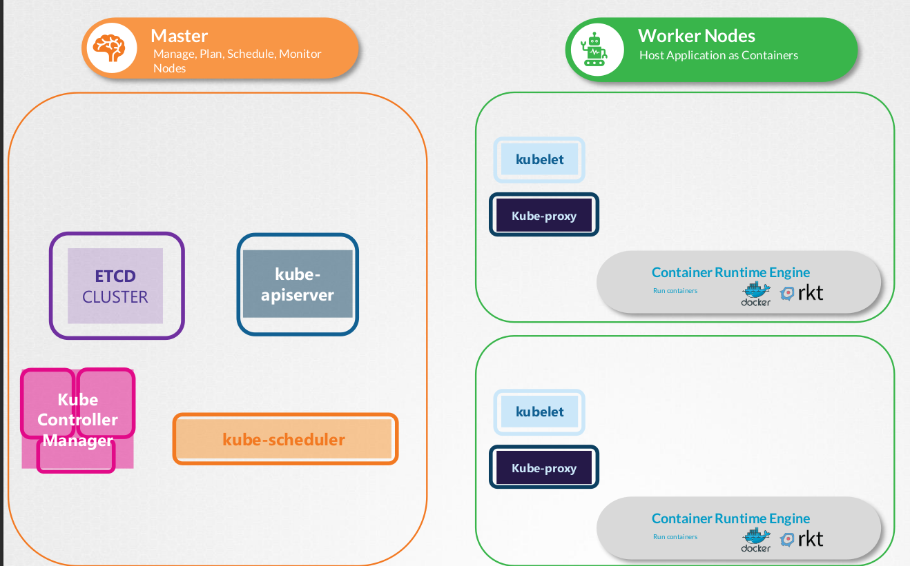
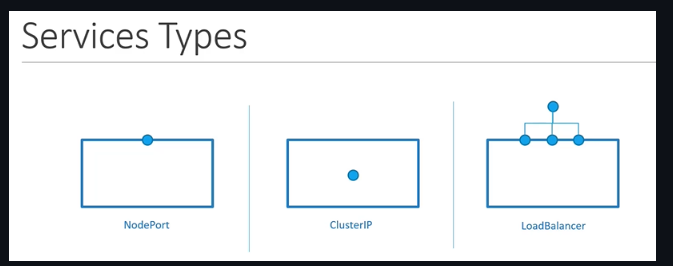
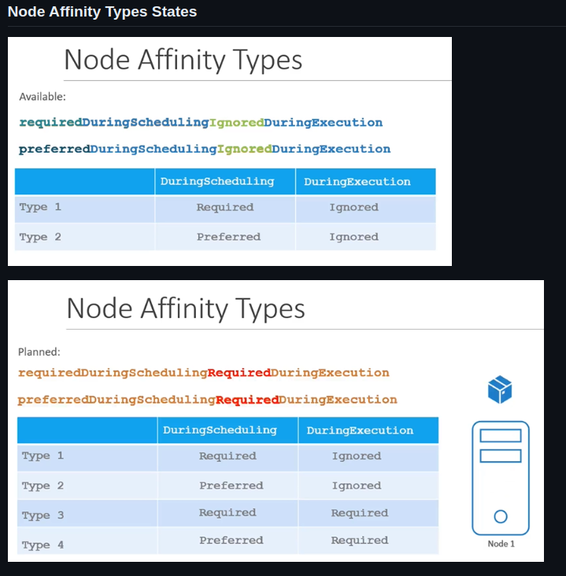
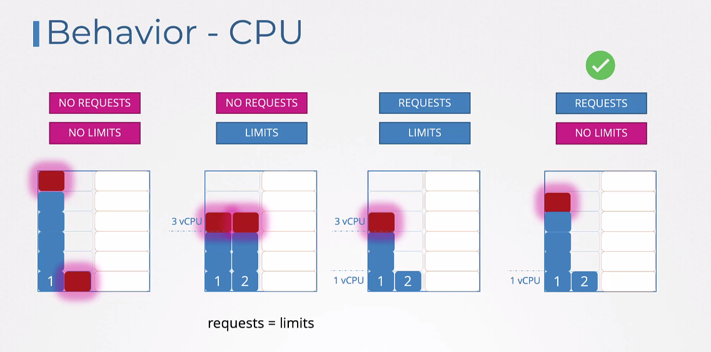
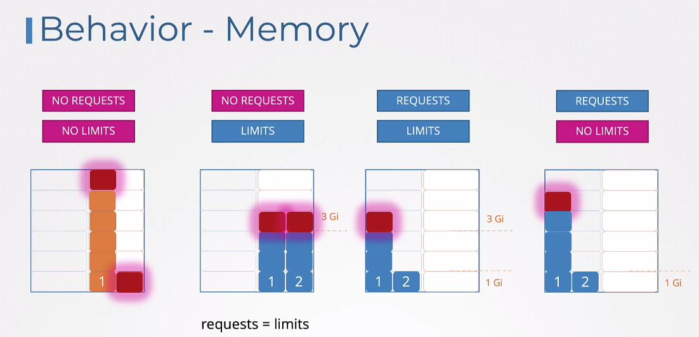
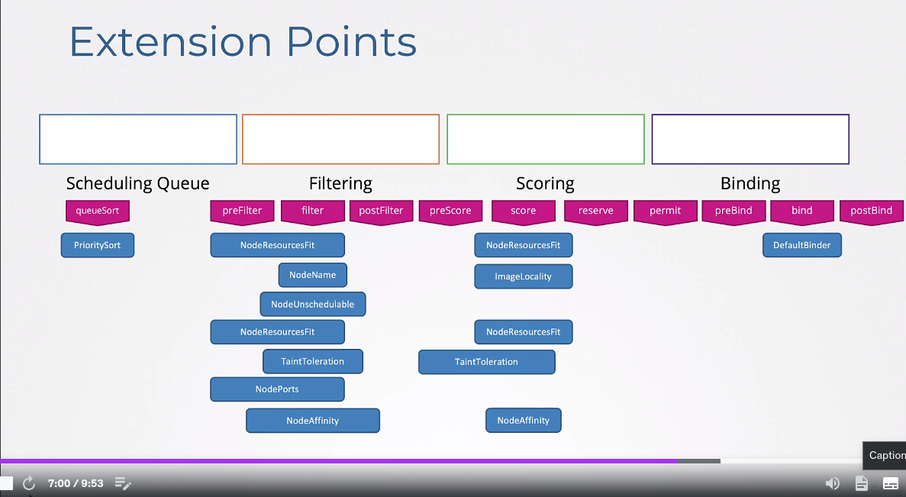

# Kubernetes CKA

{ loading=lazy }

## Core Objects

### Pods

```yaml
apiVersion: v1
kind: Pod
metadata:
  name: myapp-prod
  labels:
    app: myapp
    type: front-end
spec:
  schedulerName: my-scheduler # To Use Custom Scheduler
  containers:
    - name: nginx-container
      image: nginx
      ports:
        - containerPort: 8080
      command: ["sleep"]
      args: ["10"]
      env:
        - name: APP_COLOR
          value: pink
        - name: APP_COLOR_2 # Inject ConfigMap as Single Environment Variable
          valueFrom:
            configMapKeyRef:
              name: app-config
              key: APP_COLOR
        - name: APP_COLOR_3 # Inject Secret as Single Environment Variable
          valueFrom:
            secretKeyRef:
              name: app-secret
              key: APP_COLOR
      envFrom:
        - configMapRef: # Inject ConfigMap as Environment
            name: app-config
        - secretRef: # Inject Secret as Environment
            name: app-secret
      resources:
        requests:
          memory: "1Gi"
          cpu: "1"
        limits:
          memory: "2Gi"
          cpu: "2"
    - name: log-agent
      image: log-agent
  initContainers:
    - name: init-myservice
      image: busybox
      command: ['sh', '-c', 'git clone <some-repository-that-will-be-used-by-application> ; done;']
  volumes:
    - name: app-config-volume # Inject Config Map as a file in a Volume
      configMap:
        name: app-config
    - name: app-secret-volume # Inject Secret as a file in a Volume
      secret:
        secretName: app-secret
  tolerations: # Scheduling
  - key: "app"
    operator: "Equal"
    value: "blue"
    effect: "NoSchedule"
  nodeSelector: # Scheduling
    size: Large
  nodeName: node02 # Scheduling: Manual Scheduling
  affinity: # Scheduling
    nodeAffinity:
      requiredDuringSchedulingIgnoredDuringExecution:
        nodeSelectorTerms:
          - matchExpressions:
              - key: size
                operator: In
                values:
                  - Large
                  - Medium
```

### Services

{ loading=lazy }

* NodePort

```yaml
apiVersion: v1
kind: Service
metadata:
  name: myapp-service
spec:
  type: NodePort
  ports:
    - targetPort: 80
      port: 80
      nodePort: 30008
  selector:
    app: myapp
    type: front-end
```

* Cluster IP
```yaml
apiVersion: v1
kind: Service
metadata:
 name: back-end
spec:
 type: ClusterIP
 ports:
 - targetPort: 80
   port: 80
 selector:
   app: myapp
   type: back-end
```

### Deployments

```yaml
apiVersion: apps/v1
kind: Deployment
metadata:
  name: myapp-deployment
  labels:
    app: myapp
    type: front-end
spec:
 template:
   <POD YAML Template>
 replicas: 3
 selector:
   matchLabels:
    type: front-end
 strategy:
  type: RollingUpdate # Or Recreate
  rollingUpdate:
    maxUnavailable: 1
```

```shell
kubectl rollout status deployment/myapp-deployment
kubectl rollout history deployment/myapp-deployment
kubectl rollout undo deployment/myapp-deployment
```

### DaemonSets

```yaml
apiVersion: apps/v1
kind: DaemonSet
metadata:
  name: monitoring-daemon
  labels:
    app: nginx
spec:
  selector:
    matchLabels:
      app: monitoring-agent
  template:
    <POD YAML Template>
```

### Namespaces

* Namespace

```yaml
apiVersion: v1
kind: Namespace
metadata:
  name: dev
```

* Resource Quota

```yaml
apiVersion: v1
kind: ResourceQuota
metadata:
  name: compute-quota
  namespace: dev
spec:
  hard:
    pods: "10"
    requests.cpu: "4"
    requests.memory: 5Gi
    limits.cpu: "10"
    limits.memory: 10Gi
```

### Replica Sets

```yaml
apiVersion: apps/v1
kind: ReplicaSet
metadata:
 name: myapp-replicaset
 labels:
   app: myapp
   type: front-end
spec:
 template:
   <POD YAML Template>
 replicas: 3
 selector:
   matchLabels:
     type: front-end
```

## Scheduling

### Pod Binding

```yaml
apiVersion: v1
kind: Binding
metadata:
  name: nginx
target:
  apiVersion: v1
  kind: Node
  name: node02
```

* This file (Convert to JSON) needs to be sent via Curl

```shell
curl --header "Content-type: application/json" --request POST --data '{"apiVersion": "v1", "kind": "Binding", .... }' http://$SERVER/api/v1/namespaces/default/pods/$PODNAME/binding
```

### Taints and Tolerations

* There are 3 taint effects 
  * NoSchedule 
  * PreferNoSchedule
  * NoExecute

```shell
kubectl taint nodes <node-name> key=value:taint-effect
kubectl taint nodes node1 app=blue:NoSchedule
```

### Node Selectors and Node Affinity

{ loading=lazy }

```shell
kubectl label nodes <node-name> <label-key>=<label-value>
kubectl label nodes node-1 size=Large
```

### Resources Requests

{ loading=lazy }

{ loading=lazy }

### Scheduler Profiles

{ loading=lazy }

```yaml
apiVersion: kubescheduler.config.k8s.io/v1
kind: KubeSchedulerConfiguration
profiles:
  - schedulerName: my-scheduler
    plugins:
      score:
        disabled:
          - name: TaintToleration
        enabled:
          - name: MyCustomPluginA
          - name: MyCustomPluginB
  - schedulerName: my-scheduler-2
    plugins:
      preScore:
        disabled:
          - name: '*'
      score:
        disabled:
          - name: '*'
```

## Application Configuration

### ConfigMaps

```yaml
apiVersion: v1
kind: ConfigMap
metadata:
 name: app-config
data:
 APP_COLOR: blue
 APP_MODE: prod
```

```shell
kubectl create configmap app-config --from-literal=APP_COLOR=blue --from-literal=APP_MODE=prod
kubectl create configmap app-config --from-file=app_config.properties
```

### Secrets

```yaml
apiVersion: v1
kind: Secret
metadata:
 name: app-secret
data:
  DB_Host: bX1zcWw=
  DB_User: cm9vdA==
  DB_Password: cGFzd3Jk
```

```shell
kubectl create secret generic app-secret --from-literal=DB_Host=mysql --from-literal=DB_User=root --from-literal=DB_Password=paswrd
kubectl create secret generic app-secret --from-file=app_secret.properties
```

## Monitor

### Metrics Server

```shell
git clone https://github.com/kubernetes-incubator/metrics-server.git
kubectl create -f metric-server/deploy/1.8+/
kubectl top node
kubectl top pod
```

## Core Components

### ETCD

* Run as Binary

```shell
curl -L https://github.com/etcd-io/etcd/releases/download/v3.3.11/etcd-v3.3.11-linux-amd64.tar.gz -o etcd-v3.3.11-linux-amd64.tar.gz
tar xzvf etcd-v3.3.11-linux-amd64.tar.gz
./etcd
```

* Operate

```shell
./etcdctl set key1 value1
./etcdctl get key1
./etcdctl
```

* Manual Setup

```shell
wget -q --https-only "https://github.com/coreos/etcd/releases/download/v3.3.9/etcd-v3.3.9-linux-amd64.tar.gz"
[etcd.service]
ExecStart=/usr/local/bin/etcd \\
--name ${ETCD_NAME} \\
--cert-file=/etc/etcd/kubernetes.pem \\
--key-file=/etc/etcd/kubernetes-key.pem \\
--peer-cert-file=/etc/etcd/kubernetes.pem \\
--peer-key-file=/etc/etcd/kubernetes-key.pem \\
--trusted-ca-file=/etc/etcd/ca.pem \\
--peer-trusted-ca-file=/etc/etcd/ca.pem \\
--peer-client-cert-auth \\
--client-cert-auth \\
--initial-advertise-peer-urls https://${INTERNAL_IP}:2380 \\
--listen-peer-urls https://${INTERNAL_IP}:2380 \\
--listen-client-urls https://${INTERNAL_IP}:2379,https://127.0.0.1:2379 \\
--advertise-client-urls https://${INTERNAL_IP}:2379 \\
--initial-cluster-token etcd-cluster-0 \\
--initial-cluster controller-0=https://${CONTROLLER0_IP}:2380,controller-1=https://${CONTROLLER1_IP}:2380 \\ # HA in Environment
--initial-cluster-state new \\
--data-dir=/var/lib/etcd
```

### kube-apiserver

* Run as Binary

```shell
wget https://storage.googleapis.com/kubernetes-release/release/v1.13.0/bin/linux/amd64/kube-apiserver

[kube-apiserver.service]
ExecStart=/usr/local/bin/kube-apiserver \\
--advertise-address=${INTERNAL_IP} \\
--allow-privileged=true \\
--apiserver-count=3 \\
--authorization-mode=Node,RBAC \\
--bind-address=0.0.0.0 \\
--enable-admission-plugins=Initializers,NamespaceLifecycle,NodeRestriction,LimitRanger,ServiceAccount,DefaultStorageClass,ResourceQuota \\
--etcd-servers=https://127.0.0.1:2379 \\
--enable-swagger-ui=true \\
--event-ttl=1h \\
--experimental-encryption-provider-config=/var/lib/kubernetes/encryption-config.yaml \\
--runtime-config=api/all \\
--service-account-key-file=/var/lib/kubernetes/service-account.pem \\
--service-cluster-ip-range=10.32.0.0/24 \\
--service-node-port-range=30000-32767 \\
--v=2
```

* View Options

```shell
cat /etc/kubernetes/manifests/kube-apiserver.yaml
```

### kube-controller-manager

* Run as Binary

```shell
wget https://storage.googleapis.com/kubernetes-release/release/v1.13.0/bin/linux/amd64/kube-controller-manager

[kube-controller-manager.service]
ExecStart=/usr/local/bin/kube-controller-manager \\
--address=0.0.0.0 \\
--cluster-cidr=10.200.0.0/16 \\
--cluster-name=kubernetes \\
--cluster-signing-cert-file=/var/lib/kubernetes/ca.pem \\
--cluster-signing-key-file=/var/lib/kubernetes/ca-key.pem \\
--kubeconfig=/var/lib/kubernetes/kube-controller-manager.kubeconfig \\
--leader-elect=true \\
--root-ca-file=/var/lib/kubernetes/ca.pem \\
--service-account-private-key-file=/var/lib/kubernetes/service-account-key.pem \\
--service-cluster-ip-range=10.32.0.0/24 \\
--use-service-account-credentials=true \\
--v=2
```

* View Options

```shell
cat /etc/kubernetes/manifests/kube-controller-manager.yaml

spec:
containers:
- command:
- kube-controller-manager
- --address=127.0.0.1
- --cluster-signing-cert-file=/etc/kubernetes/pki/ca.crt
- --cluster-signing-key-file=/etc/kubernetes/pki/ca.key
- --controllers=*,bootstrapsigner,tokencleaner
- --kubeconfig=/etc/kubernetes/controller-manager.conf
- --leader-elect=true
- --root-ca-file=/etc/kubernetes/pki/ca.crt
- --service-account-private-key-file=/etc/kubernetes/pki/sa.key
- --use-service-account-credentials=true
```

### kube-scheduler

* Run as Binary

```shell
wget https://storage.googleapis.com/kubernetes-release/release/v1.13.0/bin/linux/amd64/kube-scheduler

[kube-scheduler.service]
ExecStart=/usr/local/bin/kube-scheduler \\
--config=/etc/kubernetes/config/kube-scheduler.yaml \\
--v=2
```

* View Options

```shell
cat /etc/kubernetes/manifests/kube-scheduler.yaml

spec:
containers:
- command:
- kube-scheduler
- --address=127.0.0.1
- --kubeconfig=/etc/kubernetes/scheduler.conf
- --leader-elect=true
```

### Kubelet

* Run as Binary

```shell
wget https://storage.googleapis.com/kubernetes-release/release/v1.13.0/bin/linux/amd64/kubelet

[kubelet.service]
ExecStart=/usr/local/bin/kubelet \\
--config=/var/lib/kubelet/kubelet-config.yaml \\
--container-runtime=remote \\
--container-runtime-endpoint=unix:///var/run/containerd/containerd.sock \\
--image-pull-progress-deadline=2m \\
--pod-manifest-path=/etc/kubernetes/manifests \\ # Static Pods
--kubeconfig=/var/lib/kubelet/kubeconfig \\
--network-plugin=cni \\
--register-node=true \\
--v=2
```

### kube-proxy

* Run as Binary

```shell
wget https://storage.googleapis.com/kubernetes-release/release/v1.13.0/bin/linux/amd64/kube-proxy

[kube-proxy.service]
ExecStart=/usr/local/bin/kube-proxy \\
--config=/var/lib/kube-proxy/kube-proxy-config.yaml
Restart=on-failure
RestartSec=5
```

## Usefull Commands

```shell
# Get List of Pods with more information
kubectl get pods -o wide

# Generate YAML Skeleton to POD
kubectl run redis --image=redis123 --dry-run -o yaml
```

* Namespaces

```shell
kubectl config set-context $(kubectl config current-context) --namespace=dev
kubectl get pods --all-namespaces
```