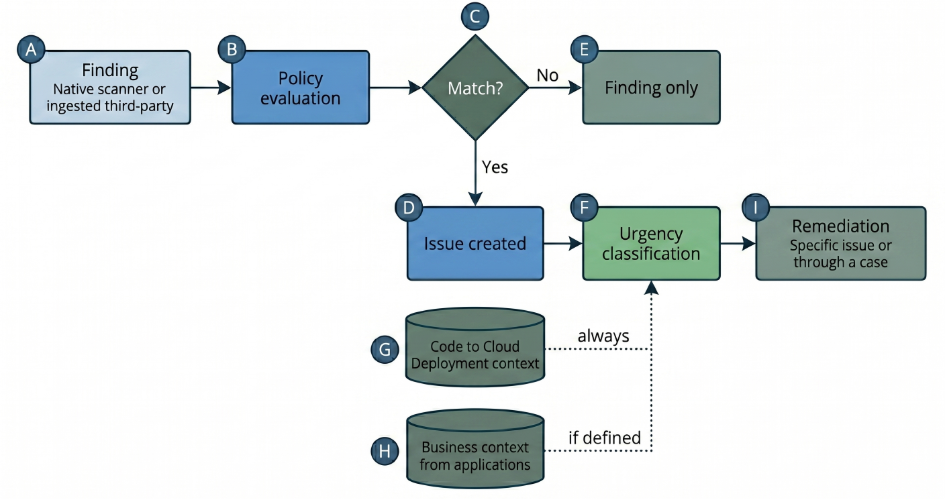

# Application Security Posture Management (ASPM)

## Overview

### Base Licenses

You must have at least one of the following active base licenses to access the Application Security module:

- Cloud Posture Security or Cloud Runtime Security
- XSIAM Premium

### Module Components

| Component                                | License Requirement                                                                                                       |
|-------------------------------------------|----------------------------------------------------------------------------------------------------------------------------|
| Application Security Posture Management (ASPM) | Included with base license                                                                                          |
| Supply Chain Security                      | Included with base license                                                                                                 |
| Code Security                              | Requires a separate Application Security Add-on purchase in addition to your existing Cloud (Posture or Runtime) or XSIAM Premium base license |

## Data Sources

| Category                       | Data Source                        | Details    | SDLC Stage  | Link |
|---------------------------------|-------------------------------------|------------|-------------|------|
| Version Control Systems         | AWS CodeCommit                      | Cloud      | Code        | [Documentation](https://docs-cortex.paloaltonetworks.com/r/Cortex-CLOUD/Cortex-Cloud-Posture-Management-Documentation/AWS-CodeCommit) |
| Version Control Systems         | Azure DevOps                        | Cloud      | Code        | [Documentation](https://docs-cortex.paloaltonetworks.com/r/Cortex-CLOUD/Cortex-Cloud-Posture-Management-Documentation/Azure-DevOps) |
| Version Control Systems         | Bitbucket Cloud                     | Cloud      | Code        | [Documentation](https://docs-cortex.paloaltonetworks.com/r/Cortex-CLOUD/Cortex-Cloud-Posture-Management-Documentation/Bitbucket-Cloud) |
| Version Control Systems         | Bitbucket Data Center               | On-Prem    | Code        | [Documentation](https://docs-cortex.paloaltonetworks.com/r/Cortex-CLOUD/Cortex-Cloud-Posture-Management-Documentation/Bitbucket-Data-Center) |
| Version Control Systems         | GitHub Cloud                        | Cloud      | Code        | [Documentation](https://docs-cortex.paloaltonetworks.com/r/Cortex-CLOUD/Cortex-Cloud-Posture-Management-Documentation/GitHub-Cloud) |
| Version Control Systems         | GitHub Enterprise                   | On-Prem    | Code        | [Documentation](https://docs-cortex.paloaltonetworks.com/r/Cortex-CLOUD/Cortex-Cloud-Posture-Management-Documentation/GitHub-Enterprise-On-Prem) |
| Version Control Systems         | GitLab SaaS                         | Cloud      | Code        | [Documentation](https://docs-cortex.paloaltonetworks.com/r/Cortex-CLOUD/Cortex-Cloud-Posture-Management-Documentation/GitLab-SaaS) |
| Version Control Systems         | GitLab Self Managed                 | On-Prem    | Code        | [Documentation](https://docs-cortex.paloaltonetworks.com/r/Cortex-CLOUD/Cortex-Cloud-Posture-Management-Documentation/GitLab-Self-Managed-On-Prem) |
| CI/CD Pipeline Systems          | CircleCI                            | Cloud      | Build/Deploy | [Documentation](https://docs-cortex.paloaltonetworks.com/r/Cortex-CLOUD/Cortex-Cloud-Posture-Management-Documentation/CircleCI-for-CI/CD-pipeline-scans) |
| CI/CD Pipeline Systems          | Jenkins                             | On-Prem    | Build       | [Documentation](https://docs-cortex.paloaltonetworks.com/r/Cortex-CLOUD/Cortex-Cloud-Posture-Management-Documentation/Jenkins-for-CI/CD-pipeline-scans) |
| CI Tools                        | AWS CodeBuild                       |            | Build/Deploy | [Documentation](https://docs-cortex.paloaltonetworks.com/r/Cortex-CLOUD/Cortex-Cloud-Posture-Management-Documentation/AWS-CodeBuild) |
| CI Tools                        | CircleCI                            | Code scans | Build/Deploy | [Documentation](https://docs-cortex.paloaltonetworks.com/r/Cortex-CLOUD/Cortex-Cloud-Posture-Management-Documentation/CircleCI-for-code-scans) |
| CI Tools                        | Cortex CLI                          |            | Cross-stage | [Documentation](https://docs-cortex.paloaltonetworks.com/r/Cortex-CLOUD/Cortex-Cloud-Posture-Management-Documentation/Connect-Cortex-CLI?tocId=~jZq~7cT788cb4CJ~WlqIg) |
| CI Tools                        | GitHub Actions                      |            | Build       | [Documentation](https://docs-cortex.paloaltonetworks.com/r/Cortex-CLOUD/Cortex-Cloud-Posture-Management-Documentation/GitHub-Actions) |
| CI Tools                        | Jenkins                             | Code scans | Build       | [Documentation](https://docs-cortex.paloaltonetworks.com/r/Cortex-CLOUD/Cortex-Cloud-Posture-Management-Documentation/Jenkins-for-code-scans) |
| CI Tools                        | Terraform Cloud                     | Run Tasks  | Build/Deploy | [Documentation](https://docs-cortex.paloaltonetworks.com/r/Cortex-CLOUD/Cortex-Cloud-Posture-Management-Documentation/Terraform-Cloud-Run-Tasks) |
| CI Tools                        | Terraform Enterprise                | Run Tasks  | Build/Deploy | [Documentation](https://docs-cortex.paloaltonetworks.com/r/Cortex-CLOUD/Cortex-Cloud-Posture-Management-Documentation/Terraform-Enterprise-Run-Tasks) |
| Private Package Registries      | JFrog Artifactory                   | On-Prem    | Cross-stage | [Documentation](https://docs-cortex.paloaltonetworks.com/r/Cortex-CLOUD/Cortex-Cloud-Posture-Management-Documentation/Onboard-JFrog-Artifactory) |
| Third-Party Security Scanners   | Semgrep                             | SCA & SAST | Cross-stage | [Documentation](https://docs-cortex.paloaltonetworks.com/r/Cortex-CLOUD/Cortex-Cloud-Posture-Management-Documentation/Semgrep) |
| Third-Party Security Scanners   | Snyk                                | SCA & SAST | Cross-stage | [Documentation](https://docs-cortex.paloaltonetworks.com/r/Cortex-CLOUD/Cortex-Cloud-Posture-Management-Documentation/Snyk) |
| Third-Party Security Scanners   | SonarQube                           |            | Cross-stage | [Documentation](https://docs-cortex.paloaltonetworks.com/r/Cortex-CLOUD/Cortex-Cloud-Posture-Management-Documentation/SonarQube) |
| Third-Party Security Scanners   | Veracode                            |            | Cross-stage | [Documentation](https://docs-cortex.paloaltonetworks.com/r/Cortex-CLOUD/Cortex-Cloud-Posture-Management-Documentation/Veracode) |
| Third-Party Security Scanners   | Generic 3rd Party AppSec Collector  |            | Cross-stage | [Documentation](https://docs-cortex.paloaltonetworks.com/r/Cortex-CLOUD/Cortex-Cloud-Posture-Management-Documentation/Generic-3rd-Party-AppSec-Collector) |

## Application Security Posture Management (ASPM)

Provides a consolidated view of application risks and vulnerabilities across your environment, enabling you to understand and manage your overall security posture.

ASPM does not execute scans. Detection and finding generation belong to Code Security (native scanners) and the Supply Chain Security pillar (VCS repository and CI/CD pipeline analysis). ASPM evaluates the findings against unified policies and orchestrates the resulting issues through to remediation.

{ loading=lazy }

[Documentation](https://docs-cortex.paloaltonetworks.com/r/BNCvOg6pEdBp~axnn92pBQ/Bw25CrPQtJJBsL9se8pEhQ)

### Code To Cloud

Full Code to Cloud (C2C) coverage is achieved when Cortex Cloud can resolve the following chain: Repository → Pipeline → Image → (optional Registry) → Runtime resources (including VMs, VM images, and IaC-defined infrastructure)

When relationships cannot be resolved, for example, due to missing YOR tags or pipeline integrations, Cortex Cloud detects coverage gaps and provides specific configuration steps to fix them.

#### Supported Integrations

| Component  | Supported Provider / Build Tool                                 |
|------------|-----------------------------------------------------------------|
| VCS        | GitHub, GitLab, Bitbucket, Azure DevOps                         |
| CI/CD      | GitHub Actions, GitLab CI/CD, Azure Pipeline, Jenkins, CircleCI |
| Containers | Docker CLI, docker compose, docker buildx, Kaniko               |
| VM Images  | AWS EC2 Image Builder, Packer (→ AWS AMI)                       |
| IaC        | Terraform (.tf), CloudFormation (.yml, .json)                   |

[Documentation](https://docs-cortex.paloaltonetworks.com/r/Cortex-CLOUD/Cortex-Cloud-Posture-Management-Documentation/Code-to-Cloud)

#### Troubleshooting

##### Incomplete Lineage

| Issue                                        | Description                                                                                                                                                               |
|----------------------------------------------|---------------------------------------------------------------------------------------------------------------------------------------------------------------------------|
| Missing YOR Tags (IaC Resources)             | IaC resources without tags cannot be mapped to runtime. The system will prompt you to tag these resources.                                                                |
| Missing Pipeline Integrations (Repositories) | If pipeline integrations are missing, the link between code and build artifacts breaks.                                                                                   |
| Inactive Pipeline                            | Lineage is generated during pipeline runs. If a pipeline is integrated but has not run, trigger a build to generate the necessary artifacts and establish the connection. |

##### Required Integrations by Deployment Type

| Deployment Type                                  | Required Integration                           | Purpose                                                  |
|--------------------------------------------------|------------------------------------------------|----------------------------------------------------------|
| IaC (Terraform / CloudFormation)                 | YOR tags on IaC resources                      | Connects templates to real cloud resources               |
| CI/CD (GitHub Actions, GitLab CI, Jenkins, etc.) | CI/CD system integration                       | Links pipelines to code and build artifacts              |
| Containers                                       | Container registry (Docker Hub, ECR, GCR, ACR) | Shows built images and where they were deployed          |
| Cloud resources                                  | AWS / GCP / Azure cloud connectors             | Discovers runtime resources (VMs, containers, databases) |

##### Full Code-to-Cloud Connection Requirements

All of the following are needed for complete lineage:

```
VCS Repository
    ↓ YOR Tags on IaC
    ↓ CI/CD Pipeline Integration
    ↓ Container / Artifact Registry
    ↓ Cloud Connectors (AWS / GCP / Azure)
    = Assets visible in the application
```

To verify coverage, go to **ASPM Command Center → Coverage** and check for gaps.

### Applications

Applications are holistic entities that span the full application lifecycle from source code to cloud infrastructure. Each application is a logical, dynamic entity that groups:

- VCS repositories
- CI/CD pipelines
- Build artifacts (container images, VM images)
- Cloud infrastructure resources
- Runtime workloads

#### Business Applications

Business Applications are a specific type of Application that adds business context to grouped assets. They allow you to define, group, and maintain assets with unified business meaning, correlate security risks across the development lifecycle, and prioritize security issues based on business impact.

#### Creation Methods

| Method              | How It Works                                                                                                                          | Automation | Best For                                     | Link |
|---------------------|---------------------------------------------------------------------------------------------------------------------------------------|------------|-----------------------------------------------|------|
| Code (VCS-based) Criteria        | Dynamically groups assets based on VCS hierarchy (Organization, Project, Repository). New matching repos are onboarded automatically. | High       | Multiple apps, structured repos              | [Documentation](https://docs-cortex.paloaltonetworks.com/r/Cortex-CLOUD/Cortex-Cloud-Posture-Management-Documentation/Define-applications-by-Code-Criteria) |
| Cloud (Tag-based) Criteria  | Dynamically groups assets based on cloud tags (AWS, GCP, Azure, OCI). Maps infrastructure tags to application metadata fields.        | High       | Cloud environments, Code-to-Cloud visibility | [Documentation](https://docs-cortex.paloaltonetworks.com/r/Cortex-CLOUD/Cortex-Cloud-Posture-Management-Documentation/Define-applications-by-cloud-tag-based-Criteria) |
| Application Builder | Manual creation starting from a code or cloud asset. Cortex Cloud suggests related assets automatically.                              | Low        | Specific apps, granular control              | [Documentation](https://docs-cortex.paloaltonetworks.com/r/Cortex-CLOUD/Cortex-Cloud-Posture-Management-Documentation/How-to-manually-build-an-application) |
| Public API          | Programmatic definition via API.                                                                                                      | High       | IaC, CI/CD pipelines, DevOps automation      | [Documentation](https://docs-cortex.paloaltonetworks.com/r/Cortex-CLOUD/Cortex-Cloud-Posture-Management-Documentation/Manage-criteria-via-the-public-API) |

#### When to Use Each Method

| Use Case                                         | Recommended Method  |
|--------------------------------------------------|---------------------|
| Multiple apps, new repos onboarded automatically | Code (VCS-based) Criteria        |
| Infrastructure organized by cloud tags           | Cloud (Tag-based) Criteria  |
| Need strong Code-to-Cloud visibility             | Cloud (Tag-based) Criteria  |
| Few specific apps with fine-grained control      | Application Builder |
| Infrastructure-as-Code or CI/CD integration      | Public API          |

### AppSec Policies

| Policy Type                       | Description                                                                                                                                                                                                              | Finding Types | Scope | Triggers |
|------------------------------------|----------------------------------------------------------------------------------------------------------------------------------------------------------------------------------------------------------------------|---------------|-------|----------|
| Code Scanners                      | Scans code for security issues throughout the development lifecycle. Covers code scanning (SAST, SCA (CVE vulnerabilities, license, package operational risk), IaC, Secrets) and image scanning (vulnerabilities, malware) across PR, periodic, and CI-triggered scans | [Vulnerabilities](https://docs-cortex.paloaltonetworks.com/r/Cortex-CLOUD/Cortex-Cloud-Posture-Management-Documentation/Reference-E-Grace-period-logic-and-configuration), Secrets, IaC Misconfigurations, Code Weaknesses (SAST), License Issues, Operational Risks, Malware | Code repositories and image registries | PR scan, CI scan, Periodic scan (code findings); CI Image scan, Image Registry scan (image findings) |
| CI/CD Configuration Scanners       | Scans CI/CD and Version Control System (VCS) environments for insecure configurations. Restricts finding types to CI/CD Risks only and triggers to Periodic scan only                                                 | CI/CD Risks | CI/CD pipeline configurations | Periodic scan only |
| Drift Detection Scanner            | Scans cloud environments to detect configuration drift between deployed resources and their IaC definitions. Restricts finding types to IaC Drift only and triggers to Periodic scan only                             | IaC Drift | Cloud assets and their associated IaC definitions | Periodic scan only |

[Reference A: Finding type details](https://docs-cortex.paloaltonetworks.com/r/Cortex-CLOUD/Cortex-Cloud-Posture-Management-Documentation/Reference-A-Finding-type-details)

[Reference D: Trigger and actions mapping](https://docs-cortex.paloaltonetworks.com/r/Cortex-CLOUD/Cortex-Cloud-Posture-Management-Documentation/Reference-D-Trigger-and-actions-mapping)

[Reference G: Finding type to trigger mapping](https://docs-cortex.paloaltonetworks.com/r/Cortex-CLOUD/Cortex-Cloud-Posture-Management-Documentation/Reference-G-Finding-type-to-trigger-mapping)

[Reference H: Action availability by trigger](https://docs-cortex.paloaltonetworks.com/r/Cortex-CLOUD/Cortex-Cloud-Posture-Management-Documentation/Reference-H-Action-availability-by-trigger)

### AppSec Rules

You can create custom rules for:

- Secrets scans
- IaC scans. Supported frameworks include Terraform, TFPlan (with automatic application of Terraform custom rules), CloudFormation, Kubernetes, Bicep, Helm, Kustomize, Helm and ARM. These scans also apply to serverless deployments

Rules are configured via a [YAML file](https://docs-cortex.paloaltonetworks.com/r/Cortex-CLOUD/Cortex-Cloud-Posture-Management-Documentation/Configure-YAML-file-properties).

## Supply Chain Security

Focuses on securing your continuous integration and continuous delivery pipelines, ensuring the integrity and security of your automated build and deployment processes.

[Documentation](https://docs-cortex.paloaltonetworks.com/r/BNCvOg6pEdBp~axnn92pBQ/drZaJdylPd3g6d2wfDJPBA)

### Software Composition Analysis (SCA) scanners

Inspects and manages the security and compliance of open-source and third-party dependencies, combining native scanning engines with ingested findings from third-party tools (e.g. Snyk, Semgrep) as part of the shift-left strategy.

Native scanning requires an AppSec add-on license (Posture Management, Runtime, or Premium Cortex) and is currently limited to direct dependencies, extending to transitive dependencies when lock files are present. Third-party ingestion extends coverage by centralizing existing external security data on the same platform.

[Documentation](https://docs-cortex.paloaltonetworks.com/r/Cortex-CLOUD/Cortex-Cloud-Posture-Management-Documentation/Software-Composition-Analysis-SCA-scanners?tocId=LmTGURG0JJ9s0cLHy4TpJg)

#### Supported SCA Frameworks and Languages

| Language     | Vulnerabilities | Operational Risk | License Detection | Transitive Dependencies | Root Fix Detection |
|--------------|------------------|-------------------|---------------------|---------------------------|----------------------|
| JavaScript   | Yes              | Yes               | Yes                 | Yes                       | Yes                  |
| Python       | Yes              | Yes               | Yes                 | Yes                       | Yes                  |
| Go           | Yes              | Yes               | Yes                 | Yes                       | Yes                  |
| Java         | Yes              | Yes               | Yes                 | Yes                       | Yes                  |
| Kotlin       | Yes              | Yes               | Yes                 | Yes                       | Yes                  |
| Ruby         | Yes              | No                | No                  | Yes                       | No                   |
| .NET (C#)    | Yes              | Yes               | Yes                 | Yes                       | Yes                  |
| PHP          | Yes              | No                | Yes                 | Yes                       | No                   |
| Rust         | Yes              | Yes               | Yes                 | Yes                       | Yes                  |

#### SCA Support Matrix by Language

| Language   | Package Manager | Manifest Files                                                                          | Supported Versions                                                                              |
|------------|------------------|------------------------------------------------------------------------------------------|---------------------------------------------------------------------------------------------------|
| JavaScript | npm              | package.json, package-lock.json                                                          | Lockfile v1, v2, v3                                                                                |
| JavaScript | yarn             | package.json, yarn.lock                                                                   | Yarn v1, v2, v3, v4                                                                                |
| Python     | pip              | requirements.txt, Pipfile, Pipfile.lock                                                  | Python v3.9 and above                                                                              |
| Go         | Go               | go.mod, go.sum, Gopkg.lock                                                                | Go v1.11 and above                                                                                 |
| Java       | Maven            | pom.xml                                                                                   | Maven v3.x and v4.x                                                                                |
| Java       | Gradle           | build.gradle, settings.gradle                                                             | Gradle v4.x through v9.x                                                                           |
| Kotlin     | Maven            | pom.xml                                                                                   | Maven v3.x and v4.x                                                                                |
| Kotlin     | Gradle           | build.gradle.kts, settings.gradle.kts                                                     | Gradle v4.x through v9.x                                                                           |
| Ruby       | —                | Gemfile, Gemfile.lock, gemspec                                                            | Ruby v2.5.x through v3.4.x                                                                         |
| .NET       | —                | .csproj, packages.config, project.assets.json, packages.lock.json, paket.lock            | .NET v5.0 through v10.0, .NET Framework v4.6 through v4.8.x, .NET Core v2.0 through v3.x           |
| PHP        | Composer         | composer.json, composer.lock                                                              | PHP v8.3 and above                                                                                 |
| Rust       | Cargo            | Cargo.toml, Cargo.lock                                                                    | Any version of Rust                                                                                |

#### License Miscompliance Findings

License miscompliance findings are potential licensing vulnerabilities in your open-source packages. Promoting a finding to an issue lets you address the non-compliance and keep your software supply chain compliant.

The Licenses Findings table (under **Application Security → Issues → Licenses → Findings**) is a filtered view of the broader Findings table (Cases & Issues), showing only license miscompliance findings — but limited to those detected via **periodic scans**. The full Findings table also includes license findings from PR and CI scans.

[Documentation](https://docs-cortex.paloaltonetworks.com/r/Cortex-CLOUD/Cortex-Cloud-Posture-Management-Documentation/License-miscompliance-findings)

#### Open-Source License Categories

Licenses are scanned as part of the SCA vulnerability scan. Critical, High, and Medium license miscompliance findings are promoted to issues. Cortex Cloud ships three default license categories, each identified via SPDX identifiers:

| Category                  | Severity | Description |
|-----------------------------|----------|-------------|
| Non-Permissive Licenses     | High     | Restrictive licenses that limit how you can use, modify, and distribute the software — may block integration into certain projects or require a commercial license for specific uses |
| Strong Copyleft Licenses    | High     | Licenses (e.g. GPL) that require derivative works to be distributed under the same copyleft terms as the original |
| Weak Copyleft Licenses      | Medium   | Licenses that allow combining the code with other licenses, including proprietary ones, without forcing the entire derivative work under the same copyleft terms |

[Documentation](https://docs-cortex.paloaltonetworks.com/r/Cortex-CLOUD/Cortex-Cloud-Posture-Management-Documentation/Open-source-software-license-categories?tocId=ESEUm25~KVWV5Af8ylY2FQ)

## Code Security

Identifies and helps mitigate security issues directly within your source code, including vulnerabilities in Infrastructure-as-Code (IaC) and open-source components, from the earliest stages of development.

[Documentation](https://docs-cortex.paloaltonetworks.com/r/BNCvOg6pEdBp~axnn92pBQ/TJUUzTRnShyUH~OazRZTNA)
