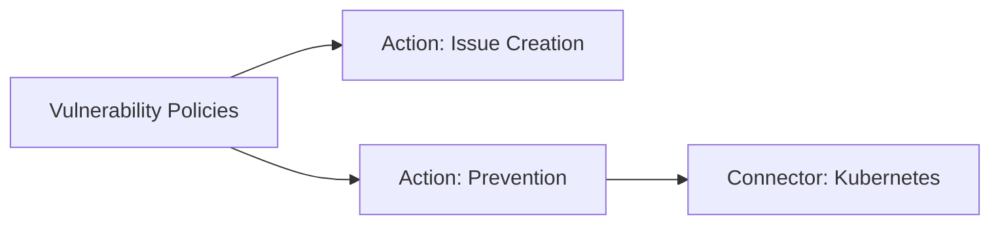
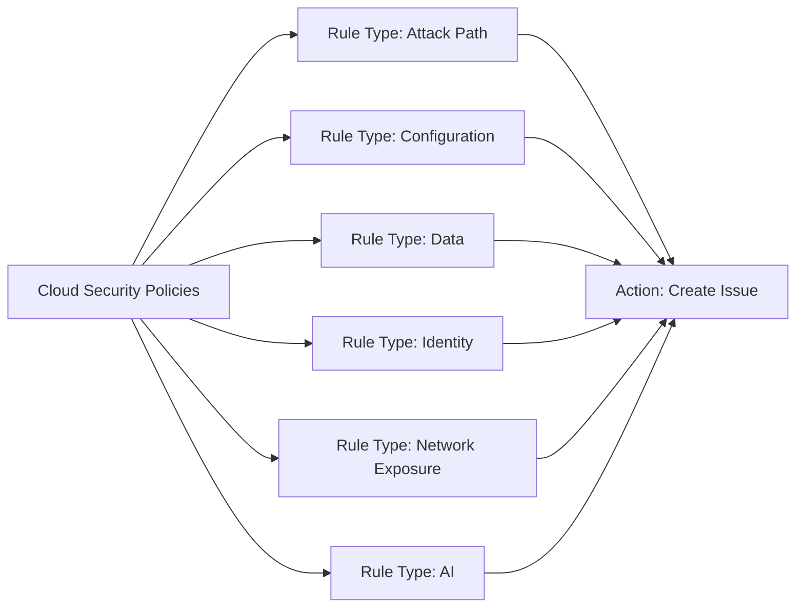
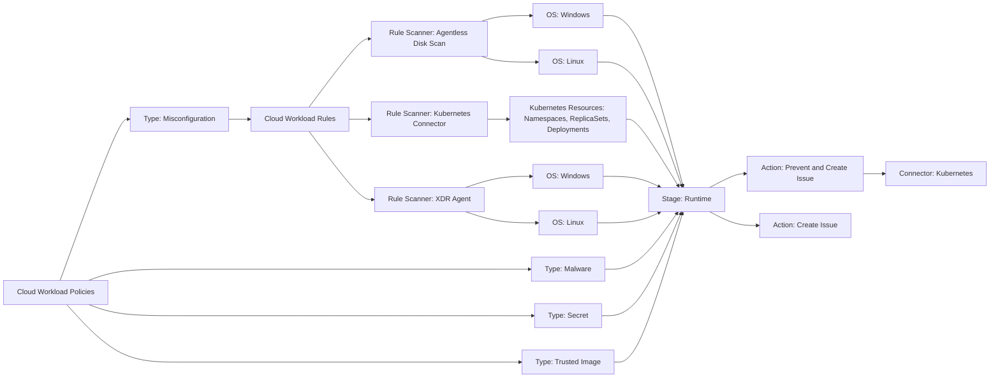
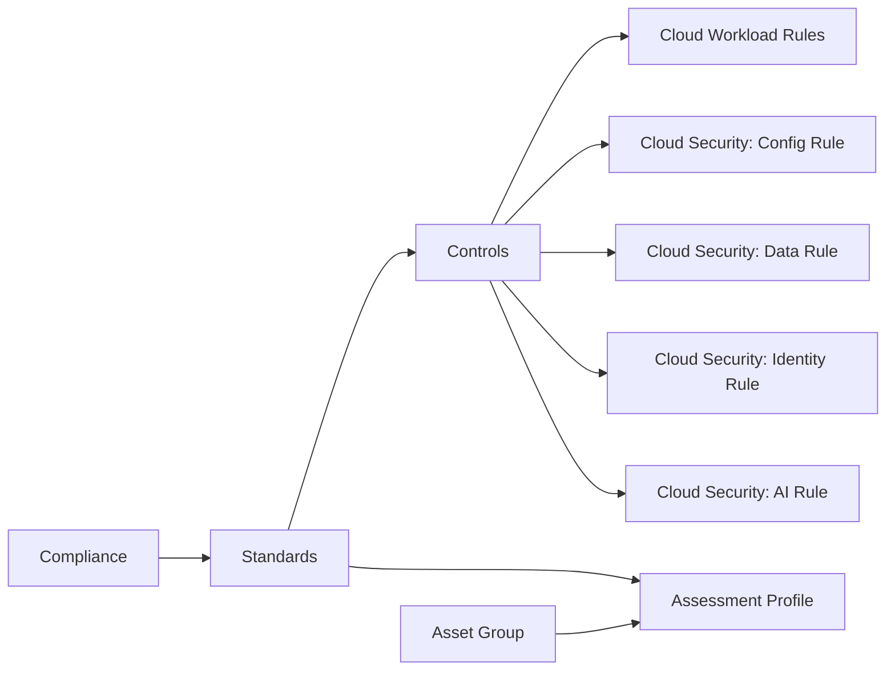

# Cloud Security Posture Management (CSPM)

## Overview

CSPM is included in the **Cloud Posture Management** license.

## Vulnerability Management

**More info:** [Cortex Cloud Vulnerability Management](https://docs-cortex.paloaltonetworks.com/r/Cortex-CLOUD/Cortex-Cloud-Runtime-Security-Documentation/Vulnerability-management)

Identifies, prioritizes, and remediates vulnerabilities across endpoints, code, and cloud — integrating into CI/CD pipelines and using runtime context to focus on what matters most.

- **Findings** — A specific vulnerability instance discovered via scan. Policies are applied to prioritize findings and promote the most critical ones to issues.
- **Issues** — Created when a finding matches a vulnerability policy. Each issue includes priority, assignee, status, asset context, and exploitability details.

!!! note
    For vulnerabilities detected via application security scans, refer to [Cortex Cloud Application Security](aspm.md).

### Vulnerability Intelligence

**More info:** [Vulnerability Intelligence](https://docs-cortex.paloaltonetworks.com/r/Cortex-CLOUD/Cortex-Cloud-Runtime-Security-Documentation/Vulnerability-Intelligence)

Real-time feed of vulnerability data and threat intelligence from certified upstream sources (CVE databases, vendor feeds, commercial providers), enriched by a dedicated research team. Provides CVE metadata, affected packages/versions, exploit intelligence (EPSS, exploit maturity), and vendor advisory links.

Each vulnerability has a **Cortex Vulnerability Risk Score (CVRS)** — a dynamic score from 0 to 100, updated daily, combining:

| Factor | Source |
|---|---|
| Vulnerability Context | CVSS base score |
| Exploit Intelligence | EPSS, CISA KEV, in-the-wild exploits, exploit maturity |
| Asset Risk | Public internet exposure |
| Environment Risk | Whether the package is actively in use |
| Compensating Controls | Existing mitigations *(requires Exposure Management add-on)* |

If the official CVSS score doesn't reflect the real risk in your environment, you can override it (**Posture Management → Vulnerability Management → Vulnerability Intelligence** → open vulnerability → Options → **Override Severity or CVSS**). Changes propagate platform-wide within ~1 hour.

### Vulnerability Policies

**More info:** [Vulnerability policies](https://docs-cortex.paloaltonetworks.com/r/Cortex-CLOUD/Cortex-Cloud-Runtime-Security-Documentation/Vulnerability-policies)

A vulnerability policy defines what action to take on findings that match specific criteria. Cortex Cloud includes predefined policies based on CVSS severity, EPSS severity, and Attack Surface Testing results. Custom policies can be created to match your organization's specific needs (e.g., only create issues for CVSS ≥ 9 on production servers, or block images with EPSS > 90% from being deployed to Kubernetes).

Each finding is evaluated against policies in order — the first match wins, no further policies are evaluated.

Each finding is evaluated against policies in order — the first match wins, no further policies are evaluated. More specific policies should be placed at the top; broader/generic policies at the bottom.

A policy is composed of:

- **Conditions** — Criteria that a finding must match (CVE attributes, EPSS score, CVSS score, exploit intelligence, etc.) and optional exclusions.
- **Scope** — Asset groups the policy applies to. If none selected, applies to all assets.
- **Action** — Defined per policy type (see below).

**To create a policy:** **Posture Management → Rules & Policies → Policies → Vulnerability Management** → **+Add Policy**.

#### Issue Creation

Creates an issue for each finding that matches the policy. You define the severity of the issue, either a fixed value or inherited from the underlying CVE severity (**Use Default CVE Severity**).

**Ignored CVEs, Asset Groups, and Assets** is a built-in policy always at position 0 in the list. It acts as a global exclusion list — findings still exist but no issues are created. You can configure:

- **Ignored Vulnerabilities** — specific CVEs to suppress
- **Ignored Asset Groups** — asset groups to suppress
- **Ignored Assets** — individual assets to suppress

Edit it via **Posture Management → Rules & Policies → Policies → Vulnerability Management** → click the first policy in the list.

#### Prevention

Blocks a deployment when a matching vulnerability is found. For example, prevent an image with a CVE with EPSS > 90% from being deployed to a Kubernetes cluster.

| Type | Action | Description |
|---|---|---|
| Kubernetes pod actions | Block new deployments | New deployments are blocked by the Kubernetes Admission Controller when matching vulnerabilities are detected in an image. Requires agent installed and activated. |
| Kubernetes pod actions | Do nothing | No action taken for matching findings on clusters with Admission Controller activated. |
| Build actions | Fail the build | Fails the build in the CI/CD system when code with a matching vulnerability is checked in. Requires agent installed and activated on the CI/CD system. |
| Build actions | Do nothing | No action taken for matching findings from code repository assets where the agent is activated. |

Prevention policies support a **block grace period** — a buffer of X days after the fix publish date (or vulnerability publish date if no fix exists) before the blocking action kicks in. Value `0` = block immediately.

## Cloud Security

Documentation: [Cloud Security Rules and Policies](https://docs-cortex.paloaltonetworks.com/r/Cortex-CLOUD/Cortex-Cloud-Runtime-Security-Documentation/Cloud-Security-Rules-and-Policies)

Cloud security rules and policies define and manage security guardrails consistently across AWS, Azure, GCP, and other cloud providers. They detect specific conditions in target environments, generating findings and issues for misconfigurations and threats.

### Rules

Cloud security rules define conditions that apply to cloud, code, or host resources. They use detection logic or XQL queries to identify threats or misconfigurations by examining asset configuration attributes. Rules are evaluated against all matching assets, generating findings when matching criteria are met.

All rule types share common fields: **Name**, **Description**, **Severity** (inherited by findings), **Labels** (optional), and optional **Remediation** instructions.

#### Rule Types

##### Attack Path

Documentation: [Create an Attack Path Rule](https://docs-cortex.paloaltonetworks.com/r/Cortex-CLOUD/Cortex-Cloud-Runtime-Security-Documentation/Create-and-manage-cloud-security-rules)

Identifies critical risks from combinations of risk signals — overly permissive identities, network exposures, and vulnerabilities — that together form a potential breach path to high-value assets.

**Rule Logic:** Select a primary asset, then attach **Finding** and/or **Vulnerability** conditions. The rule triggers on the intersection of any selected findings AND the vulnerability on the asset (not all conditions need to be present simultaneously).

##### Configuration

Documentation: [Create a Configuration Rule](https://docs-cortex.paloaltonetworks.com/r/Cortex-CLOUD/Cortex-Cloud-Runtime-Security-Documentation/Create-a-configuration-rule)

Monitors resource configurations for misconfigurations and policy violations. Supports two modes:

- **Simple:** Guided dropdowns for common conditions.
- **Advanced:** Free-form XQL queries against the `asset_inventory` dataset. Conditions use `xdm.asset.raw_fields` to access configuration JSON. Requirements: asset type must be specified via `xdm.asset.type.id`, output must include `asset_id` and `asset_type_id`, maximum 10 output fields, `fields` stage must be last.

Supports optional association with **custom compliance controls**.

##### Data

Documentation: [Create a Data Rule](https://docs-cortex.paloaltonetworks.com/r/Cortex-CLOUD/Cortex-Cloud-Runtime-Security-Documentation/Create-a-data-rule)

Detects malware and classifies sensitive data across cloud storage assets (databases, disks, buckets).

**Rule Logic:** Select an asset category (database, disk, bucket), add WHERE conditions on asset attributes, then attach Finding conditions (Configuration Finding, Data Finding, Identity Finding, etc.) with their own WHERE conditions.

##### Identity

Documentation: [Create an Identity Rule](https://docs-cortex.paloaltonetworks.com/r/Cortex-CLOUD/Cortex-Cloud-Runtime-Security-Documentation/Create-an-identity-rule)

Monitors cloud identities for excess or unused permissions.

##### Network Exposure

Documentation: [Create a Network Exposure Rule](https://docs-cortex.paloaltonetworks.com/r/Cortex-CLOUD/Cortex-Cloud-Runtime-Security-Documentation/Create-a-network-exposure-rule)

Detects assets exposed to unrestricted public internet access. Powered by the **Cloud Network Analyzer (CNA)**.

##### AI

Documentation: [Create an AI Rule](https://docs-cortex.paloaltonetworks.com/r/Cortex-CLOUD/Cortex-Cloud-Runtime-Security-Documentation/Create-an-AI-rule)

Detects misconfigurations and security flaws across AI infrastructure, supply chains, and data models for AWS Bedrock, Amazon SageMaker, Azure OpenAI, and GCP Vertex AI.

**Rule Logic:** Select AI asset categories (Dataset, AI Model, Model Endpoint), add WHERE conditions to define risk criteria (e.g., models trained on sensitive data buckets, models with public exposure).

Supports optional association with **custom compliance controls**.

### Policies

Cloud security policies define the **scope** (which assets a rule applies to) and **enforcement** (what happens when a rule triggers), complementing the detection logic provided by rules.

A policy consists of:

- **Rules:** Select existing detection rules or create new ones.
- **Scope:** Filter which assets the rule applies to.

Rules alone generate findings across all assets. When associated with a policy, findings within the policy scope are promoted to **issues**.

> **Note:** With SBAC enabled (`User Settings → Cases and Issues Scope → Posture`), Issues/Cases/Findings counts may diverge. The Rules page counts Cases in the Posture domain; Platform pages count Issues within Cases in the Posture domain.

## Cloud Workload

Documentation: [Cloud Workload Policies and Rules](https://docs-cortex.paloaltonetworks.com/r/Cortex-CLOUD/Cortex-Cloud-Runtime-Security-Documentation/Cloud-Workload-Policies-and-Rules)

Cloud Workload Policies prevent and manage security violations in cloud runtime instances by applying detection logic to specific asset groups at the desired SDLC stage, and defining the action to take when conditions are met.

### Policies

A Cloud Workload Policy is composed of the following elements:

- **SDLC Evaluation Stage:** The stage at which the policy is applied:
    - **CI:** During pipeline build, before pushing the artifact to a registry.
    - **Deploy:** When the artifact is pushed to a cloud instance.
    - **Runtime:** When the artifact is running on a cloud instance. The Prevent action at this stage applies only to Kubernetes Workload Images assets.
- **Rule (Conditions):** Logical conditions that trigger the policy evaluation.
- **Scope:** Filter defining which assets the rule applies to.
- **Action:** Response triggered when the rule evaluates successfully — can create an issue or block the security violation.

#### Policy Types

##### Misconfiguration

**SDLC Evaluation Stage:** Runtime

Assess workloads for misconfigurations against security standards and organizational guidelines. Supports both predefined and custom rules, and can either prevent violations or create issues.

##### Malware

**SDLC Evaluation Stage:** Runtime, CI, Deploy

Detect and manage malicious files within cloud workloads. Analyzes files based on predefined parameters such as name, path, size, and detection method.

##### Secret

**SDLC Evaluation Stage:** Runtime, CI, Deploy

Identify and protect sensitive information — such as API keys and credentials — within workloads.

##### Trusted Image

Documentation: [Trusted image cloud workload policies](https://docs-cortex.paloaltonetworks.com/r/Cortex-CLOUD/Cortex-Cloud-Posture-Management-Documentation/Trusted-image-cloud-workload-policies)

**SDLC Evaluation Stage:** Runtime

**Scope (Asset Groups):** The policy applies only to cloud workload asset types available at the Runtime stage — container images, container instances, hosts (VM instances), serverless functions, or Kubernetes workloads — that belong to the selected asset groups.

Ensure the authenticity, integrity, and security of container images and VMs deployed into Kubernetes environments. Includes actions such as limiting allowed image sources and mitigating image tampering.

**Trust Verdict Unavailable:**

When insufficient information exists at deployment time, Cortex cannot determine if an image is trusted or untrusted. Common causes:

- **Missing scan data:** First-time evaluation where data from a prior scan (e.g. base layer info, CLI scan status) is not yet available.
- **Partial deployment metadata:** The deployment file omits metadata required by the policy (e.g. policy requires a tag, but the Kubernetes resource references only the image digest/SHA).

**Decision Logic:**

- **Issue-only policies:** Any image that fails the trust criteria generates a Posture Issue (non-blocking; the image is allowed despite the finding).
- **Prevent policies:**
    - **Conflicting allow/block policies:** If multiple policies apply to the same image and one allows while another blocks, the image is allowed (*Allow-Wins* principle).
    - **Mixed images in the same workload:** If a workload contains both trusted and untrusted images, the entire deployment is blocked (a single untrusted image prevents execution).

#### Preventive Action

Some policies support a **Prevent and Create an Issue** action that enforces compliance during deployments.

**Runtime Stage:**

- Prevention applies only to **Kubernetes Workload Images** assets via the Kubernetes Admission Controller (requires KSPM Connector with Admission Control enabled on the cluster).
- For all other asset types in scope, prevention is skipped and an Issue is created instead.
- Managed from the Kubernetes Connectivity Management page (`/cwp/k8s-management`).

**CI Stage:**

- Prevention triggers a pipeline failure by returning **exit code 2** in the CI tool.

> **Recommended approach:** Start with *Create an Issue* to validate results before switching to *Prevent and Create an Issue*, to avoid disrupting deployments.
> Prevention only affects **new or future** deployments — already-running assets are not impacted.

### Rules

Cloud Workload Rules define the criteria for identifying security violations, applied to assets and findings in your cloud environment. Rules alone only enable detection — they must be included in a policy to trigger a preventive response or generate an issue.

**Scanners:**

- **Agentless Disk Scan:** Inspects container images using the Agentless Disk Scanner. Supports OS-specific rules (e.g. checking for malicious entries in `etc\hosts` on Windows images).
- **Kubernetes Connector:** Inspects Kubernetes environment variables and resources such as Namespaces, ReplicaSets, and Deployments.
- **XDR Agent:** Performs custom compliance checks by executing user-defined Python scripts via the XDR Agent Scanner.

## Containers

### Image Types

| Image Type | Description | Discovery Method | Key Properties |
|---|---|---|---|
| **Core Image** | Immutable content of the image; foundation for all other types. | — | Identified by SHA256 digest. Contains file-related findings (vulnerabilities, secrets, malware). Can reference another Core Image as its base. No scope — cannot belong to an asset group or policy directly. |
| **Build Image** | Image produced by a CI/CD pipeline or build process. | CLI scanning | Includes build metadata (build time, source repo, build environment). Contains build-specific findings and issues. Represents a Core Image. |
| **Registry Image** | Image stored in a container registry (AWS ECR, Azure ACR, Google GAR, JFrog Artifactory, Docker). | Cloud discovery or registry scanning | Includes registry metadata (FQDN, repository name, tags, manifest digests). Resides within an image repository. Represents a Core Image. |
| **Runtime Image** | Image stored, running, or defined in a workload (VMs, Kubernetes workloads). | Agentless Disk scan / XDR agent scan | Contains deployment and operational findings (config deviations, policy violations). File-related findings are derived from the connected Core Image. Represents a Core Image. |

All image types can be queried via XQL and are listed under **Inventory → All Assets → Compute → Container Images**.

### Base Images Rule

Documentation: [Base Images Rule](https://docs-cortex.paloaltonetworks.com/r/Cortex-CLOUD/Cortex-Cloud-Runtime-Security-Documentation/Base-Images-Rule)

Defines which registry images are considered foundational base images in the organization, creating `BASE_REFERENCE` relations between images for bidirectional lineage tracing.

**Capabilities:**

- Identify the base image for any given image
- View all dependent images derived from a specific base image
- Identify affected base images during vulnerability investigations
- Use base image associations in policies, queries, and filters

**Filter conditions:** Registry URL, Repository name, Image Name, Image Tag (supports Equals, Not Equals, Contains, Not Contains, Starts With, Ends With).

Rules can be created from **Posture Management → Rules & Policies → Rules → Base Images** or directly from a Registry Image asset card (**Inventory → Assets → All Assets → Compute → Container Images** → More options → *Add base image rule*).

> Changes take up to **6 hours** to propagate across assets.

## Compliance

Measures how well your cloud assets adhere to industry, regulatory, and organizational standards, by continuously assessing assets against the requirements defined in a chosen compliance standard.

**Standards** are guidelines organizations follow to comply with industry best practices, regulations, and internal policies. A standard is made up of **controls** — measures that ensure compliance and mitigate risk, and can be grouped into categories (e.g. RBAC, Pod security). Each control is in turn built from one or more **rules** — the specific checks that run on an asset. Both catalogs include built-in industry standards/controls as well as custom organizational ones.

- **[Choose a compliance standard](https://docs-cortex.paloaltonetworks.com/r/Cortex-CLOUD/Cortex-Cloud-Runtime-Security-Documentation/Choose-compliance-standards-from-the-compliance-catalog)** — Select the compliance standard(s) to track from the built-in compliance catalog (e.g. CIS, PCI DSS, NIST, SOC 2, ISO 27001).
- **[Create a compliance assessment](https://docs-cortex.paloaltonetworks.com/r/Cortex-CLOUD/Cortex-Cloud-Runtime-Security-Documentation/Use-an-assessment-profile-to-run-compliance-checks-on-your-assets)** — Use an assessment profile (compliance standard(s) + asset scope) to run compliance checks against your assets.
- **[Review the results](https://docs-cortex.paloaltonetworks.com/r/Cortex-CLOUD/Cortex-Cloud-Runtime-Security-Documentation/View-and-manage-compliance-assessments-and-reports)** — View and manage compliance assessments and reports.

### Associate a Custom Control to a Detection Rule

Documentation: [Associate a custom control to a detection rule](https://docs-cortex.paloaltonetworks.com/r/Cortex-CLOUD/Cortex-Cloud-Runtime-Security-Documentation/Associate-a-custom-control-to-a-detection-rule)

> **Note:** Custom rules can only be associated with custom compliance controls.

| Rule Type | OOTB rules | Custom rules |
|---|---|---|
| **Cloud workload rules** | N/A | When creating or editing custom cloud workload rules, you can associate custom compliance controls with them. |
| **Cloud security rules** — Note: only `Config`, `Data`, `Identity`, and `AI` rule types support this. | You can edit existing out-of-the-box cloud security rules and associate custom compliance controls with them. | When creating or editing custom cloud security rules, you can associate custom compliance controls with them. |

### Assessment Profile

An assessment profile runs scans on asset groups to check whether the assets adhere to a specific standard. To create one: **Posture Management → Compliance → Assessment Profiles → Create New Assessment**, then select a compliance standard and one or more asset groups to run it against.

**Documentation:** [Configuring assessments for custom compliance standards based on custom cloud security rules](https://docs-cortex.paloaltonetworks.com/r/Cortex-CLOUD/Cortex-Cloud-Runtime-Security-Documentation/Configuring-assessments-for-custom-compliance-standards-based-on-custom-cloud-security-rules)

Custom cloud security rules don't automatically generate findings, so for custom compliance standards based on custom rules, you must also create a cloud security policy that includes those rules — otherwise assessment results will be inaccurate.

| Component                        | Requirements                                                                                                                                                                                                                                                      |
|----------------------------------|-------------------------------------------------------------------------------------------------------------------------------------------------------------------------------------------------------------------------------------------------------------------|
| **Custom compliance standard**   | Create a custom compliance standard as usual.                                                                                                                                                                                                                     |
| **Custom compliance controls**   | Create custom compliance controls and populate the custom standard with the relevant custom controls.                                                                                                                                                             |
| **Custom cloud security rules**  | Create custom cloud security rules that implement the detection logic for the corresponding controls, and associate them with the relevant custom compliance controls.                                                                                            |
| **Asset group**                  | Create an asset group with the appropriate scope of assets for the custom compliance standard.                                                                                                                                                                    |
| **Assessment profile**           | Create an assessment profile for the custom standard using the asset group created above. Configure reporting as desired.                                                                                                                                         |
| **Custom cloud security policy** | Create a cloud security policy with **Rules** scope = *Compliance Standards* → *Contains* → your custom compliance standard, and **Scope** = the asset group used for the assessment profile. Required because custom rules don't generate findings on their own. |
