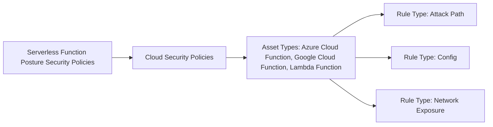

# Serverless Function Posture Security

## Overview

[Documentation](https://docs-cortex.paloaltonetworks.com/r/Cortex-CLOUD/Cortex-Cloud-Runtime-Security-Documentation/Serverless-function-posture-security)

## Supported Platforms

**Supported architecture**: x86_64

**Supported cloud providers**:

- Amazon Web Services (AWS): Lambda functions
- Google Cloud Platform (GCP): Google Cloud Functions - 1st gen and 2nd gen Cloud Functions API
- Microsoft Azure: Azure functions

## Policies

Serverless function posture policies are created under **Posture Management → Rules & Policies → Cloud Security** (under **Policies**) → **Create Policy**.

When building a policy, rules can be selected using one of two methods:

| Method | Description |
|--------|-------------|
| All Matching Filter Criteria | Allows you to filter for rules according to criteria |
| From Rules List | Filter the rules list by the type of serverless function |

### From Rules List

1. Select **From Rules List**.
2. Select **Asset Type** from the **Select Field** menu of the query.
3. Filter for the following serverless functions, depending on the target cloud provider for the rule (you can select multiple options):
      - Azure Cloud Function
      - Google Cloud Function: Google Cloud Functions - 1st gen and 2nd gen (Cloud Functions API and Cloud Run Admin API)
      - Lambda Function
4. Select a rule or multiple rules from the resulting list.

## Rules

Rules are organized into the following categories:

| Category | Description |
|----------|-------------|
| Attack Path | These rules identify combined risks in your serverless function configurations, like overly permissive roles and network exposure, that could be exploited to breach your serverless applications |
| Config | These rules detect security resource misconfigurations in your serverless function configurations and their related code and pipeline infrastructure |
| Network Exposure | These rules detect internet-exposed serverless functions by leveraging network configurations monitored across your cloud environment |
