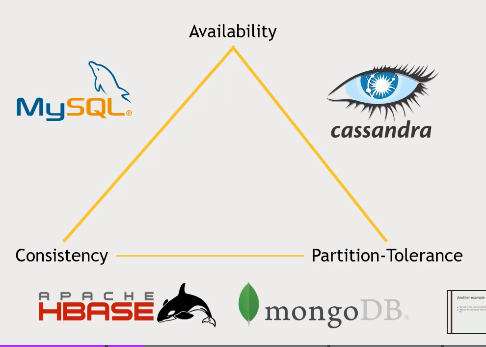

# DataWarehouse

[Slides](files/Course+slides+-+Data+Warehouse+-+The+Ultimate+Guide.pdf)

## CAP (NoSQL)

{ loading=lazy }

* Accumulo is another NoSql database similiar to HBase, but offers better security model. Consider this database if your NoSQL needs have complex security requirements.
    * But make sure the systems that need to read this data can talk to it

## Query Engines

### Presto

* Optimized for OLAP
* Connects to lot big data databases
* Exposes JDBC, Command-Line and tableau interfaces

### Phoenix

* SQL Driver for Hbase (Exposes JDBC Connector) that supports transactions
* OLTP Support
* Supports Secondary indices and UDF
* Integrates with MapReduce, Spark, Hive, Pig and Flume
* Very fast, no performance cost from having this extra layer on top of HBASE
* Why Phoenix and not HBAse native client support
    * If prefer work with SQL
    * Can do the work of optimizing more complex queries
        * Remember, HBASE is still non-relational!