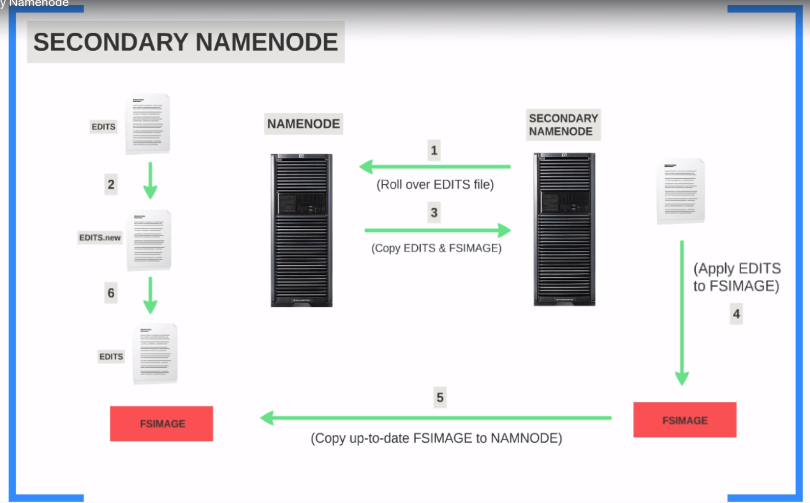
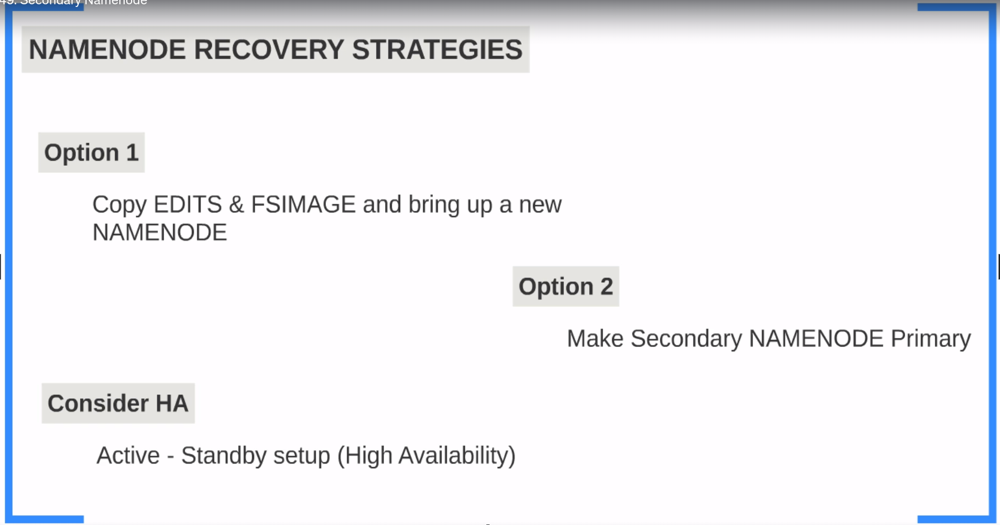
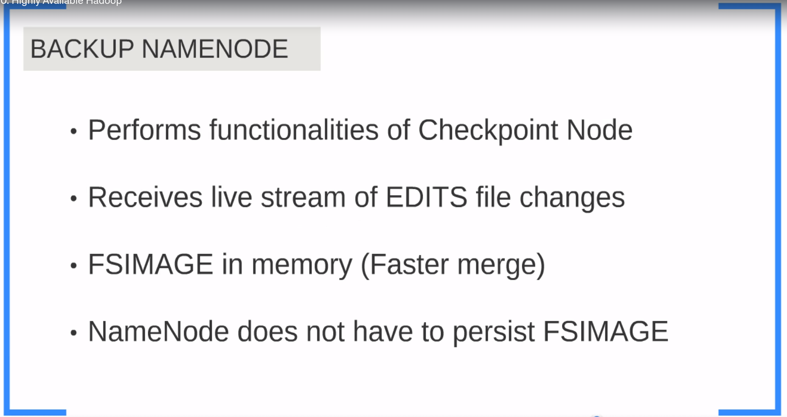
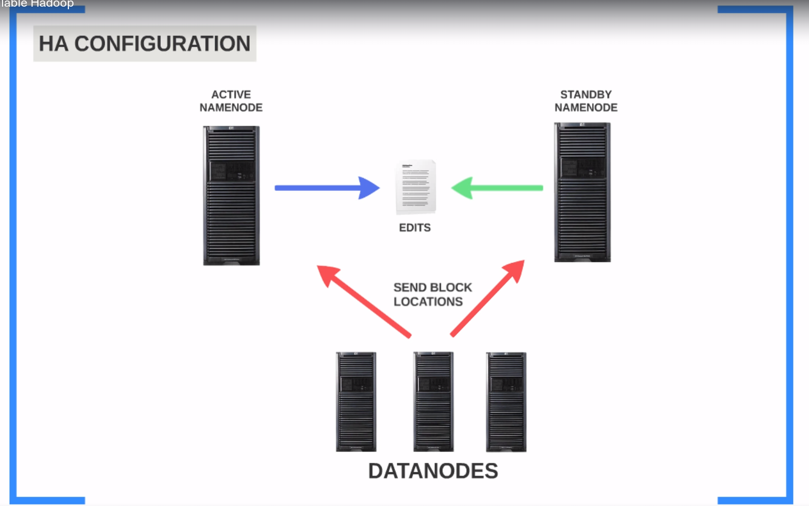
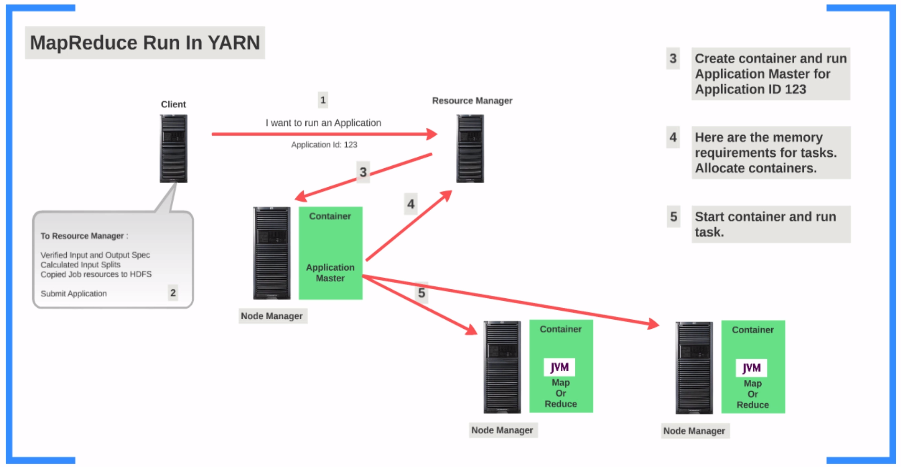

# HDFS

The Hadoop Distributed File System ([HDFS](https://hadoop.apache.org/docs/r1.2.1/hdfs_design.html)) is a distributed file system designed to run on commodity hardware.

## File Operations

### List

```shell
hadoop fs -ls /
hadoop fs -ls
hadoop fs -ls /user/user
```

### Create Dir

```shell
hadoop fs -mkdir hadoop-test1
```

### Copy Files

* Copy From Local

```shell
hadoop fs -copyFromLocal  /hirw-starterkit/hdfs/commands/dwp-payments-april10.csv hadoop-test1
```

* Copy from hdfs

```shell
hadoop fs -copyToLocal hadoop-test1/dwp-payments-april10.csv .
```

* Copy/Move Files

```shell
hadoop fs -cp hadoop-test1/dwp-payments-april10.csv hadoop-test2
hadoop fs -mv hadoop-test1/dwp-payments-april10.csv hadoop-test3
```

### Replication

* Check Replication

```shell
hadoop fs -ls hadoop-test3
```

* Change or set replication factor

```shell
hadoop fs -Ddfs.replication=2 -cp hadoop-test2/dwp-payments-april10.csv hadoop-test2/test_with_rep2.csv
```

### Change Permissions

```shell
hadoop fs -chmod 777 hadoop-test2/test_with_rep2.csv
```

### File System Check

```shell
sudo -u hdfs hdfs fsck /user/hirwuser150430/hadoop-test2 -files -blocks -locations
sudo -u hdfs hdfs fsck /user/ubuntu/input/yelp/yelp_academic_dataset_review.json -files -blocks -locations
```

### Delete files

```shell
hadoop fs -rm hadoop-test2/test_with_rep5.csv
```

## Configuration Files

### core-site.xml

| Properties                     | Value                                                                                                                                                                 | Description          |
|:-------------------------------|:----------------------------------------------------------------------------------------------------------------------------------------------------------------------|:---------------------|
| fs.defaultFS                   | hdfs://ip:port                                                                                                                                                        | Location of NameNode |
| io.compression.codecs          | org.apache.hadoop.io.compress.DefaultCodec,org.apache.hadoop.io.compress.GzipCodec,org.apache.hadoop.io.compress.BZip2Codec,org.apache.hadoop.io.compress.SnappyCodec |                      |
| hadoop.proxyuser.mapred.groups | *                                                                                                                                                                     |                      |
| hadoop.proxyuser.mapred.hosts  | *                                                                                                                                                                     |                      |


### hdfs-site.xml

| Properties                       | Value                 | Description                                                                |
|:---------------------------------|:----------------------|:---------------------------------------------------------------------------|
| dfs.namenode.name.dir            | file:///data/1/dfs/nn | Location in the file system where namenode can store the files and blocks  |
| dfs.datanode.name.dir            | file:///data/1/dfs/nn | Location in the file system where data node can store the files and blocks |
| dfs.datanode.http-address        | ip:port               | HTTP Address of namenode. Give Access to UI                                |
| dfs.permissions.superusergroup   | hadoop                |                                                                            |
| dfs.webhdfs.enabled              | true                  |                                                                            |


### mapred-site. xml

| Properties                          | Value   | Description             |
|:------------------------------------|:--------|:------------------------|
| mapreduce.framework.name            | yarn    | Put classic to use MRv1 |
| mapreduce.jobhistory.address        | ip:port |                         |
| mapreduce.jobhistory.webapp.address | ip:port |                         |
| yarn.app.mapreduce.am.staging-dir   | user    |                         |


### yarn-site.xml

| Properties                                                | Value                                   | Description                                                                      |
|:----------------------------------------------------------|:----------------------------------------|:---------------------------------------------------------------------------------|
| yarn.resourcemanager.hostname                             | ip:port                                 | Resource Manager Hostname                                                        |
| yarn.resourcemanager.webapp.address                       | ip:port                                 | Yarn Web UI (Use Public IP if want access outside). Only worked with dns, not IP |
| yarn.nodemanager.log-dirs                                 | file:///data/1/yarn/logs                | Location of the logs on NodeManager                                              |
| yarn.log.aggregation.enable                               | true                                    | Indicates if want aggregate logs                                                 |
| yarn.nodemanager.remote-app-log-dir                       | hdfs://var/log/hadoop-yarn/apps         | Where to aggregate logs                                                          |
| yarn.resourcemanager.resource-tracker.address             | ip:port                                 | Use Private IP                                                                   |
| yarn.resourcemanager.address                              | ip:port                                 | Use Private IP                                                                   |
| yarn.resourcemanager.scheduler.address                    | ip:port                                 | Use Private IP                                                                   |
| yarn.resourcemanager.admin.address                        | ip:port                                 | Use Private IP                                                                   |
| yarn.application.classpath                                | $HADOOP_CONF_DIR                        | Classpath for typical applications                                               |
| yarn.nodemanager.aux-services                             | mapreduce_shuffle                       |                                                                                  |
| yarn.nodemanager.aux-services.mapreduce.shuffle.class     | org.apache.hadoop.mapred.ShuffleHandler |                                                                                  |
| yarn.nodemanager.local-dirs                               | file:///data/1/yarn/local               |                                                                                  |


### Other Files

| File    | Value                                   |
|:--------|:----------------------------------------|
| masters | Specify the name of secondary name node |
| slaves  | list of all datanodes                   |

## CheckPoint Node (Secondary NameNode)

{ loading=lazy }

{ loading=lazy }

 ## Backup NameNode

{ loading=lazy }

## HA Configuration

{ loading=lazy }

## Yarn

{ loading=lazy }

Supports Log Aggregation

### Memory Settings

- For Individual Tasks
    - mapreduce.map.memory.mb
    - mapreduce.map.memory.mb
- Min and Max Allowed
    -  yarn.schedular.capacity.minimum-allocation-mb
    - yarn.scheduler.capacity.maximum-allocation-mb
