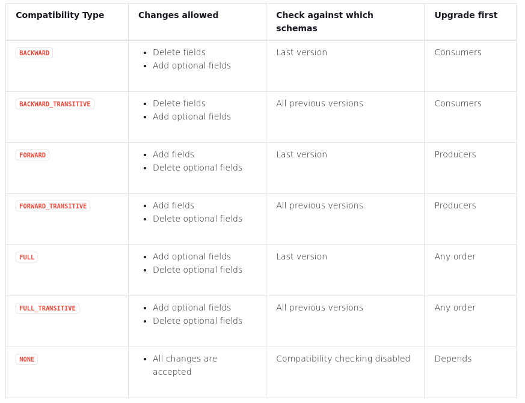
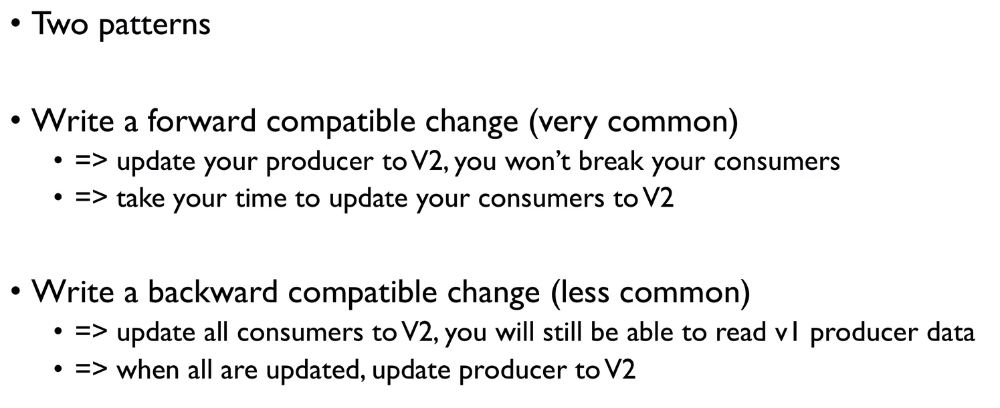
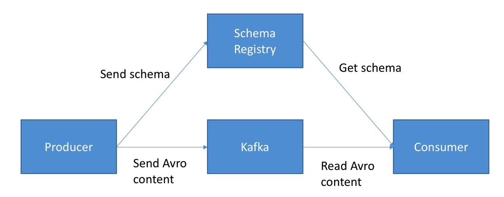
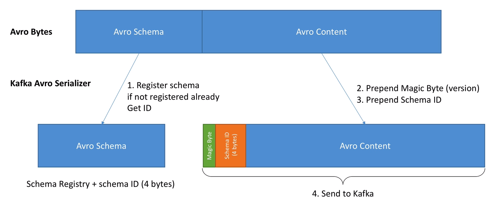
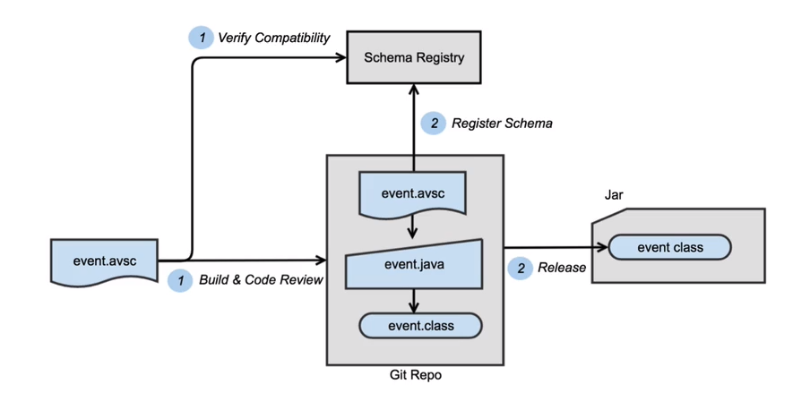

# Confluent Schema Registry

## Schema Evolution

* Schema Evolution Rules

{ loading=lazy }

* Compatibility Changes
  
{ loading=lazy }

## Deep Dive

* Schema Registry Kafka Flow

{ loading=lazy }

* Avro Kafka Message with Schema Registry

{ loading=lazy }

## Managing Schemas Efficiently

* Create a repository that holds your schema and generate your SpecificRecord classes. Publish that schema using CICD onde deemed valid and compatible with the current schemas

{ loading=lazy }

* In projects, reference the published classes for your schema using maven for example
* Always aim for FULL compatibility with existing


## Docker Local Development

* Schema Registry

```shell
docker run -d --name schema_registry -e SCHEMA_REGISTRY_ACCESS_CONTROL_ALLOW_ORIGIN='*' -e SCHEMA_REGISTRY_ACCESS_CONTROL_ALLOW_METHODS=GET,POST,PUT,OPTIONS -e SCHEMA_REGISTRY_KAFKASTORE_BOOTSTRAP_SERVERS=ip-10-0-10-52.eu-west-1.compute.internal:9092,ip-10-0-0-167.eu-west-1.compute.internal:9092 -e SCHEMA_REGISTRY_HOST_NAME=schemaregistry -p 8081:8081  confluentinc/cp-schema-registry
```

* Landoop Schema Registry UI

```shell
docker run -d -p 8000:8000 -e PROXY=true -e "SCHEMAREGISTRY_URL=http://172.17.0.1:8081" landoop/schema-registry-ui
```