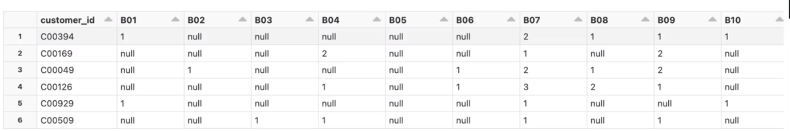
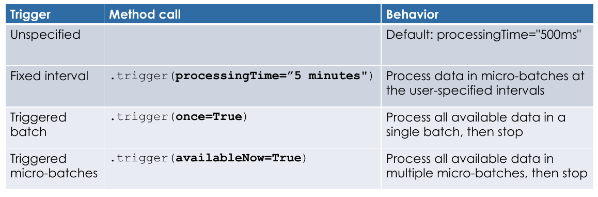
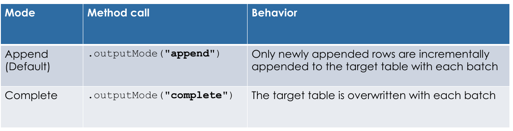
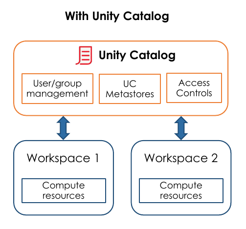
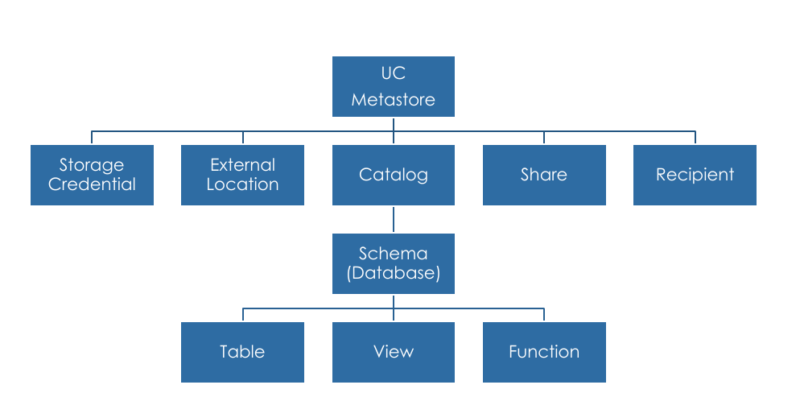
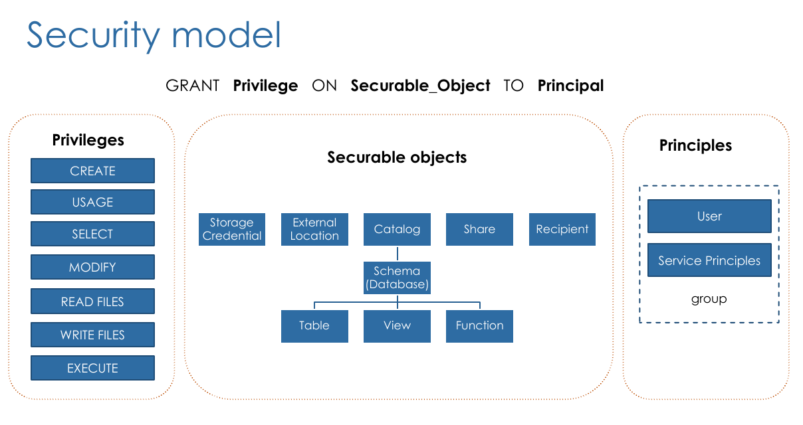

# Databricks

## Assets

[Practice Exam](files/PracticeExam_DatabricksDataEngineerAssociate.pdf)

[Exam Link](https://www.webassessor.com/databricks)

Udemy Course

## Delta Lake

* Brings ACID transactions to object storage
* Handle scalable metadata
* Full audit trail of all changes
* Builds upon standard data formats: Parquet + Json 
* Describe Commands and

```sql
DESCRIBE EXTENDED table
DESCRIBE DETAIL table
DESCRIBE DATABASE EXTENDED database
```

### Features

#### Time travel

```sql
DESCRIBE HISTORY command
```

* Query older versions of the data

```sql
SELECT * FROM my_table TIMESTAMP AS OF "2019-01-01"
SELECT * FROM my_table VERSION AS OF 36
SELECT * FROM my_table@v36
```

* Rollback Versions

```sql
RESTORE TABLE my_table TO TIMESTAMP AS OF "2019-01-01"
RESTORE TABLE my_table TO VERSION AS OF 36
```

#### Compaction & Indexing

* Compacting Small Files

```sql
OPTIMIZE my_table
```

* Co-locate column information (Indexing)

```sql
OPTIMIZE my_table
ZORDER BY column_name
```

#### Vacuum a Delta Table

* Cleaning up unused data files
  * Uncommitted files
  * Files that are no longer in the latest table state
* Default retention period: 7 days
* Note: Vacuum = no time travel

```sql
VACUUM table_name RETAIN 7 DAYS
```

#### Relational Entities

* Managed Tables
  * Created under the database directory (CREATE without LOCATION Keyword)
  * Dropping the table, delete the underlying data files
* External Tables
  * Created outside the database directory (CREATE with LOCATION Keyword)
  * Dropping the table, will not delete the underlying data files

```sql
CREATE SCHEMA db_y
LOCATION `dbfs:/custom/path/db_y.db`
```

### Delta Tables

#### CTAS

* Not Support manual schema declaration

```sql
CREATE TABLE table_1
COMMENT "Contains PII"
PARTITIONED BY (city, birth_date)
LOCATION '/some/path'
AS SELECT * FROM table_2
```

#### Table Constraints

* NOT NULL constrains
* CHECK Constraints ON
* Modes
  * DROP ROW - Discard Records
  * FAIL UPDATE - Cause Pipeline Fail
  * Ommitted - Records violating constraints will be kept, and reported in metrics

```sql
ALTER TABLE table_name ADD CONSTRAINT valid_date CHECK (date > '2020-01-01')

CREATE OR REFRESH STREAMING LIVE TABLE table_name(
    CONSTRAINT constrain_name EXPECT (order_id IS NOT NULL) ON VIOLATION DROP ROW
) ....
```

#### DEEP CLONE

* Fully copies data + metadata from a source table to a target table
* Can Sync changes
  
```sql
CREATE TABLE table_clone
DEEP CLONE source_table
```

#### Shallow cloning

Just copy the Delta transaction logs

```sql
CREATE TABLE table_clone
SHALLOW CLONE source_table
```

#### Views

##### (Stored) Views

* Persisted objects

```sql
CREATE VIEW view_name 
AS query
```

##### Temporary Views

* Session-scoped view
* Spark Session
  * Opening a new notebook
  * Detaching and reattaching to cluster
  * Installing a python package
  * Restarting a cluster

```sql
CREATE TEMP VIEW view_name 
AS query
```

##### Global Temporary Views

* Cluster-scoped view
* Dropped when cluster restarted

```sql
CREATE GLOBAL TEMP VIEW view_name 
AS query

SELECT * FROM global_temp.view_name
```

### ELT With Spark SQL and Python

#### Querying Files Directly

```sql
SELECT * FROM file_format.`/path/to/file`

# Extract files as raw bytes (Images or unstructured data)
SELECT * FROM binaryFile.`/path/to/file`         
```

* CTAS directly with Files
  * Do Not support file options
* Create Table and/OR ctas
  * Is not delta table

Solution:

```sql
CREATE TEMP VIEW temp_view_name(col_name1 col_type1, ...)
USING data_source # CSV, JSON, PARQUET
OPTIONS (key1 = val1, key2 = val2, ...)
LOCATION = path

CREATE TABLE table_name 
AS SELECT * FROM temp_view_name
```

#### Writing Tables

```sql
CREATE OR REPLACE TABLE table_name AS
SELECT * FROM parquet.`/path/to/file`
------
INSERT OVERWRITE table_name
SELECT * FROM parquet.`/path/to/file`
```

* UpSert

```sql
CREATE OR REPLACE TEMP VIEW customers_updates AS
SELECT * FROM json.`/customers-json-new`

MERGE INTO customers c
USING customers_updates u
ON c.customer_id = u.customer_id
WHEN MATCHED AND c.email IS NULL AND u.email IS NOT NULL THEN
    UPDATE SET email = u.email, updated = u.updated
WHEN NOT MATCHED THEN INSERT *
```

#### Advanced Transformations

##### String Fields

```sql
SELECT profile:first_name, profile:address:country
FROM customers
```

##### Working with Structs

```sql
# from_json Convert Json String to Struct
SELECT from_json(profile, schema_of_json(<json_record_example>)) as profile_struct
FROM customers

SELECT json_profile.first_name. json_profile.address.country
FROM customers

SELECT json_profile.* # Flat Struct Fields to Columns
FROM customers
```

##### Arrays

* explode 
  * Converts each item of array in row

```sql
SELECT explode(books)
FROM customers
```

* collect_set
  * Creates array based group by field
  * Can be use with flatten and array_distinct to get only distinct values

```sql
SELECT customer_id, 
       collect_set(order_id) as orders_set,
       collect_set(books.book_id) AS books_set
FROM orders
GROUP BY customer_id

SELECT customer_id,
       collect_set(order_id) as orders_set,
       array_distinct(flatten(collect_set(books.book_id))) AS books_set
FROM orders
GROUP BY customer_id
```

##### Pivot Table

{ loading=lazy }

```sql
SELECT * FROM (
    SELECT
        customer_id,
        book.book_id AS book_id,
        book_quantity AS quantity
    FROM orders
    PIVOT (
        sum(quantity) FOR book_id IN (
            'B01', 'B02', 'B03', ...
        )
        )
)
```

##### Filter
  * Filter array using lambda function

```sql
SELECT
    order_id,
    books,
    FILTER (books, i -> i.quantity >= 2) as multiple_copies
FROM orders
WHERE size(multiple_copies) > 0
```

##### Transform
  * Apply transformation in all items on array

```sql
SELECT
    order_id,
    books,
    TRANSFORM (
        books,
        b -> CAST(b.subtotal * 0.8 AS INT)
      ) AS subtotal_after_discount
FROM orders
```

##### UDF

```sql
CREATE OR REPLACE FUNCTION get_url(email STRING)
RETURNS STRING
    
RETURN concat("https://www.", split(email, "@")[1])
    
CREATE OR REPLACE FUNCTION site_type(extension STRING)
RETURNS STRING
    
RETURN CASE
    WHEN email like "%.com" THEN "Commercial business"
    ELSE concat("Unknow extenstion for domain", split(email, "@")[1])
  END;
```

### Incremental Data Processing

#### Data Stream

* Any data source that grows over time
* Updates to a database captured in a CDC feed
* Events queued in pub/sub messaging feed

{ loading=lazy }

{ loading=lazy }

* Checkpoint
  * Store stream state
  * Track the progress of your stream processing
  * Can Not be shared between separate streams
* Guarantees
  * Fault Tolerance
    * Checkpointing + write-ahead logs
      * record the offset range of data being processed during each trigger interval
  * Exactly-once guarantee
    * Idempotent sinks
* Unsupported Operations
  * Sorting
  * Deduplication
* Advanced methods
  * Windowing
  * Watermarking

```python
streamDF = spark.readStream.table("Input_Table")

streamDF.writeStream
    .trigger(processingTime="2 minutes")
    .outputMode("append")
    .option("checkpointLocation", "/path")
    .table("Output_Table")
```

#### Incremental Data Ingestion

##### COPY INTO

* SQL Command
* Idempotently and incrementally load new data files
  * Files that have already been loaded are skipped

```sql
COPY INTO my_table
FROM '/path/to/files'
FILEFORMAT = CSV
FORMAT_OPTIONS ('delimiter' = 'l', 'header' = 'true')
COPY_OPTIONS ('mergeSchema' = 'true')
```

##### Auto Loader

* Structured Streaming
* Can process billions of files
* Checkpointing
  * Store metadata of discovered files
  * Exactly-once guarantees
  * Fault tolerance
  * Could be used with SQL in streaming table

```python
spark.readStream.
        .format("cloudFiles")
        .option("cloudFiles.format" <source_format>)
        .option("cloudFiles.schemaLocation" <source_directory>)
        .load("/path/to/files")
    .writeStream
        .option("checkpointLocation", <checkpoint_directory>)
        .option("mergeSchema", "true")
        .table(<table_name>)

```

### Production pipelines

#### Delta Live Tables

* Clusters Mode
  * Legacy Autoscaling
    * Min & Max Workers
  * Enchanced autoscaling
  * Fixed Size

```sql
CREATE OR REFRESH STREAMING LIVE TABLE table_name
COMMENT "The raw books orders"
AS SELECT * FROM cloud_files("/path/to/file", "parquet", map("schema", "order_id STRING, order_timestamp LONG"))
---
CREATE OR REFRESH LIVE TABLE table_name
COMMENT "The raw books orders"
AS SELECT * FROM json.`/path/to/file`
---
CREATE OR REFRESH STREAMING LIVE TABLE table_name(
    CONSTRAINT constrain_name EXPECT (order_id IS NOT NULL) ON VIOLATION DROP ROW
)
COMMENT "The raw books orders"
AS 
    SELECT * 
    FROM STREAM (LIVE.orders_raw) o
    LEFT JOIN LIVE.customers c
        ON o.customer_id = c.customer_id
```

#### Change Data Capture

* Orders late-arriving records using the sequencing key
* Default assumption is that rows will contain inserts and updates
* Can optionally apply deletes (APPLY AS DELETE WHEN condition)
* Specify one or many fields as the primary key for a table
* Specify columns to ignore with the EXCEPT keyword
* Support applying changes as SCD Type 1 (default) or SCD type2
* Cons
  * Breaks the append-only requirements for streaming table sources
    * Can Not perform streaming queries against the table

```sql
CREATE OR REFRESH STREAMING LIVE TABLE books_silver;
APPLY CHANGES INTO LIVE.target_table
FROM STREAM(LIVE.cdc_feed_table)
KEYS(key_field)
APPLY AS DELETE WHEN operation_field = "DELETE"
SEQUENCE BY sequence_field
COLUMNS * EXCEPT (row_status, row_time)
```

#### Jobs

* Several Notebooks (Can be Delta Live Pipelines notebooks) running

#### Databricks SQL

* SQL Wharehouse
  * Compute for Databricks SQL (JDBC)
  * Dashboards

### Data Governance

#### Data Objects Privileges

* Object
  * CATALOG
  * SCHEMA
  * TABLE
  * VIEW
  * FUNCTION
  * ANY FILE - controls access to the underlying filesystem

* Privileges
  * SELECT
  * MODIFY
  * CREATE - create object
  * READ_METADATA
  * USAGE - No effect! required to perform any action on a database object
  * ALL PRIVILEGES

* Granting Privileges by Role
  * Databricks Administrator
  * Catalog Owner
  * Database Owner
  * Table Owner

```sql
GRANT <PRIVILEGE> ON <OBJECT> <object_name> TO <user or group>
    
GRANT SELECT ON TABLE my_table TO user1@company.com

DENY
REVOKE
SHOW GRANTS
```

#### Unity Catalog

* Users
  * Identified by email
* Service Principles
  * Identified by Applications IDs
* Groups
  * Grouping Users and Services Principles
  * Nested Groups

{ loading=lazy }

{ loading=lazy }

{ loading=lazy }