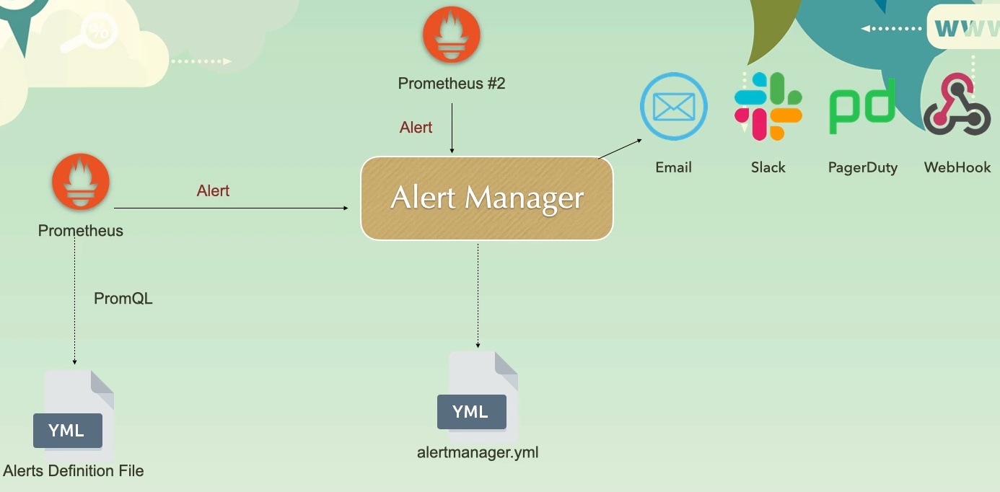

# Alert Manager

{ loading=lazy }

## Config

```yaml
global:
  smtp_smarthost: 'smtp.gmail.com:587' # Change to your SMTP server and port
  smtp_from: 'yourname@gmail.com' # Change @gmail.com to your email address
  smtp_auth_username: 'yourname@gmail.com' # Change @gmail.com to your email address
  smtp_auth_password: 'your-app-specific-password'
  smtp_require_tls: true #disable if you don't want to use TLS e.g., for local testing

route:
  receiver: 'main_receiver'
  routes:
  - receiver: 'urgent_receiver'
    matchers:
    - severity="Critical"

receivers:
- name: 'main_receiver'
  email_configs:
  - to: 'yourname@gmail.com' # Change to your receiver email address
    send_resolved: true

- name: 'urgent_receiver'
  email_configs:
  - to: 'yourname@gmail.com' # Change to your receiver email address
    send_resolved: true
    headers:
      subject: 'Urgent: Critical Alert'

- name: 'slack_receiver'
  slack_configs:
    - api_url: '<slack_api_url>'
      channel: '#udemy-course-for-prometheus'

- name: 'pager_duty_receiver'
  pagerduty_configs:
    - service_key: '<service_key>'

inhibit_rules:
  - source_match:
      team: "Team Alpha"
    target_match:
      team: "Team Beta"
    equal: ['Severity']
```