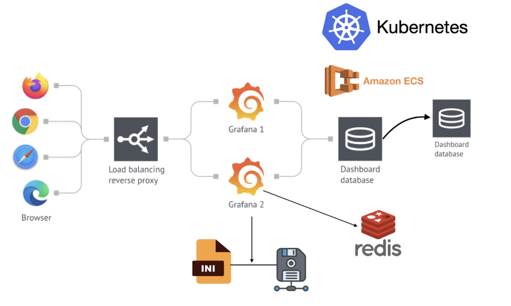
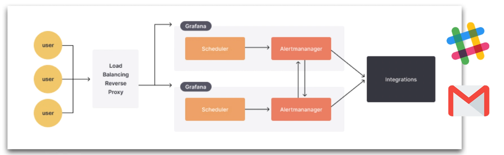

# Grafana

{ loading=lazy }

{ loading=lazy }

[Documentation](https://aref-files-for-public.s3.ap-southeast-2.amazonaws.com/Grafana+HA.pdf)

## Unified Alerting Config

### Without Redis

```toml
[unified_alerting]
enabled = true

ha_peers = "10.0.0.5:9094, 10.0.0.6:9094,10.0.0.7:9094"
```

### Redis

```toml
[unified_alerting]
enabled = true

ha_redis_address =
ha_redis_username =
ha_redis_password =
ha_redis_db =
ha_redis_prefix = "grafana"
```