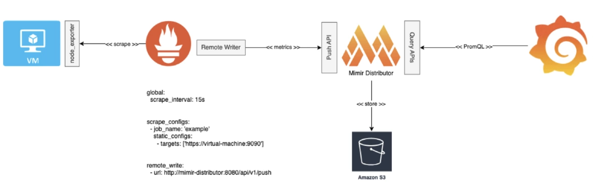
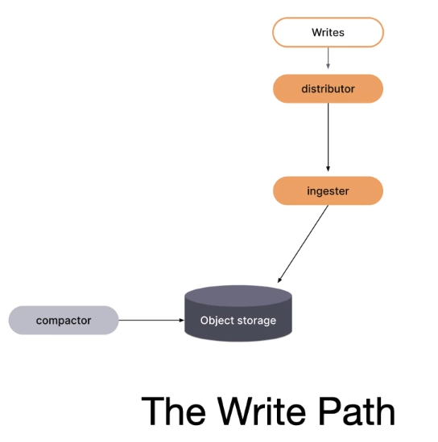
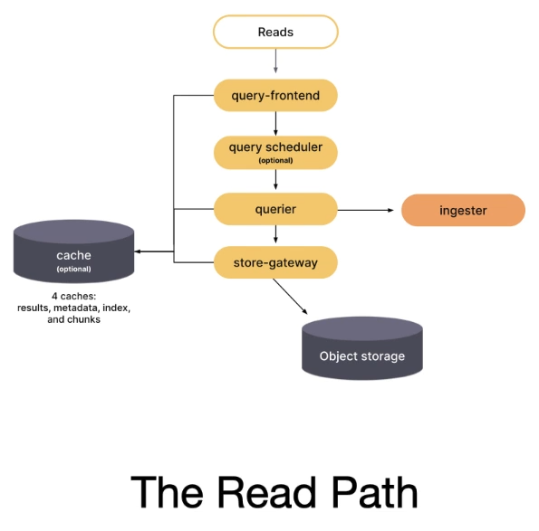
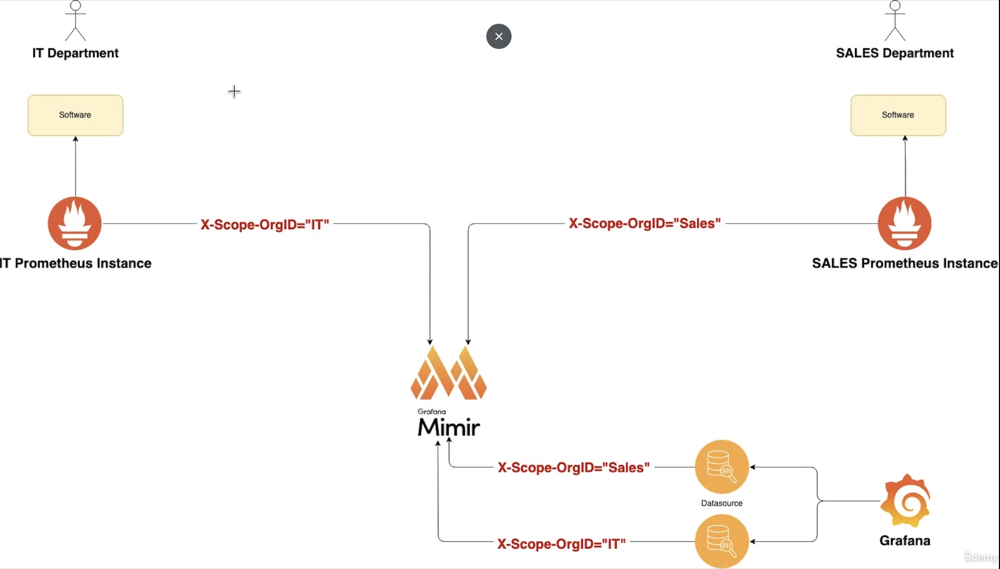

# Grafana Mimir

{ loading=lazy }

{ loading=lazy }

{ loading=lazy }

{ loading=lazy }

## Config

```yaml
multitenancy_enabled: false

server:
  http_listen_port: 9009
  grpc_listen_port: 9095

common:
  storage:
    backend: s3
    s3:
      bucket_name: <your-bucket-name> # Replace with your S3 bucket name
      endpoint: s3.amazonaws.com # Use a specific endpoint if using non-default region or custom S3 provider
      region: ap-southeast-2     # Use your AWS region
      access_key_id:
      secret_access_key:
      insecure: false            # Set to true if using non-HTTPS S3-compatible storage (e.g., MinIO in dev)

blocks_storage:
  backend: s3
  s3:
    bucket_name: <your-blocks-bucket-name> # Replace with your S3 bucket name for blocks
    endpoint: s3.amazonaws.com
    region: ap-southeast-2
    access_key_id:
    secret_access_key:
    insecure: false
    
# --- Alerting related configurations ---
ruler:
  enable_api: false
  #enabled_tenants: [Tenant1] # to explicitly enable ruler for specific tenants
  alertmanager_url: http://localhost:9008/alertmanager  # do not set if you deploy with Helm
  ring:
    kvstore:
      store: memberlist
      
ruler_storage:
  backend: filesystem
  filesystem:
    dir: /var/mimir/ruler
  storage_prefix: ""
  local:
    directory: ""

alertmanager:
  enable_api: true
  sharding_ring:
    kvstore:
      store: memberlist
      prefix: alertmanagers/
  fallback_config_file: /configs/fallback_alertmanager.yaml
  
alertmanager_storage:
  backend: s3
  s3:
    bucket_name: <your-alertmanager-bucket-name> # Replace with your S3 bucket name for Alertmanager
    endpoint: s3.amazonaws.com
    region: ap-southeast-2
    access_key_id:
    secret_access_key:
    insecure: false

ingester:
  ring:
    replication_factor: 1
    kvstore:
      store: memberlist #consul, etcd, or memberlist

distributor:
  ring:
    kvstore:
      store: memberlist

store_gateway:
  sharding_ring:
    kvstore:
      store: memberlist

querier:
  sharding_ring:
    kvstore:
      store: memberlist  # or etcd, consul
```

## Alerts File

```yaml
# Tenant1-rules.yaml
groups:
  - name: shoehub.rules
    interval: 1m
    rules:
      - alert: HighBootsSalesRate
        expr: sum(rate(shoehub_sales{ShoeType="Boots"}[1m])) > 1
        for: 1m
        labels:
          severity: warning
        annotations:
          summary: "High sales rate for Boots detected"
          description: "The sales rate for Boots ({{ $value }} per second) exceeds 10."
```

* Load File

```shell
./mimirtool rules sync --address=http://localhost:9008 --id=Tenant1 ./Tenant1-rules.yaml
```
