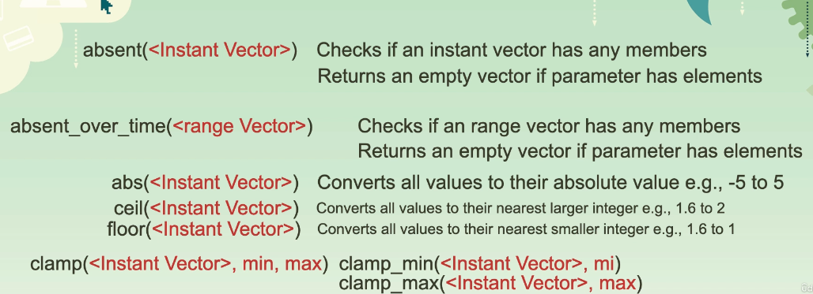
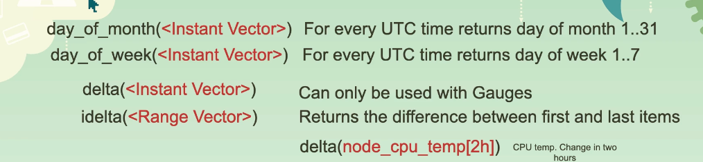
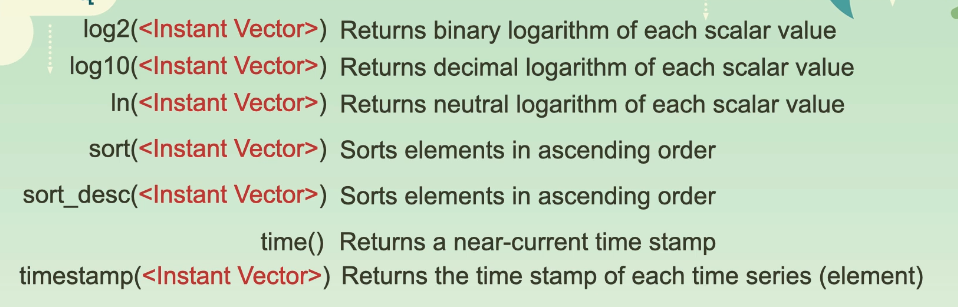
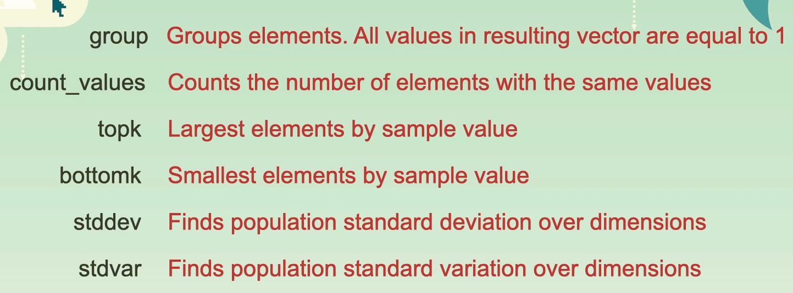
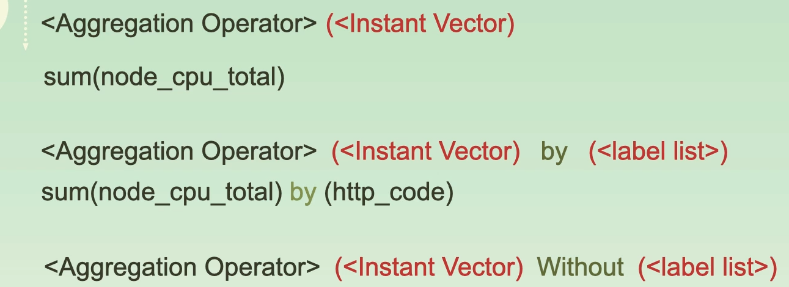
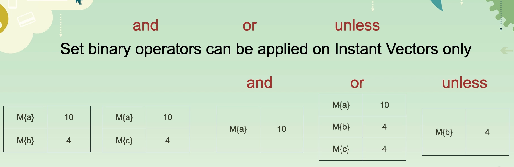
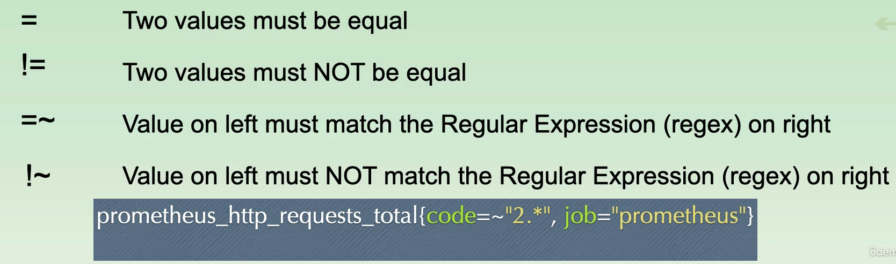

# Prometheus

[Udemy Course Github](https://github.com/aussiearef/Prometheus)

## Config

```yaml
global:
  scrape_interval: 5s

scrape_configs:
  - job_name: 'shoehub'
    static_configs:
      - targets:
          - shoehub:8080
  - job_name: "prometheus"
    static_configs:
      - targets: ["localhost:9090"]
  - job_name: "node_exporter"
    static_configs:
      - targets: ["localhost:9100"]
  - job_name: "file sd"
    file_sd_configs:
      - files:
          - /usr/local/etc/file_sd/*.yml
  - job_name: "aws sd"
    ec2_sd_configs:
      - port: 9090
        region: eu-west-1
        access_key: <access_key>
        secret_key: <secret_key>
        filters:
          - name: tag:Name
            values:
              - dev-*
    relabel_configs:
      - source_labels: [__meta_ec2_tag_Name, __meta_ec2_private_ip]
        target_label: instance
      - source_labels: [__meta_ec2_tag_Name]
        target_label: dev-test-.*
        action: drop
      - source_labels: [__meta_ec2_public_ip]
        target_label: ${1}:9090

rule_files:
  - "rule/alerts.yml"
  - "rule/recording_rule.yml"

alerting:
  alertmanagers:
  - scheme: https
    tls_config:
      ca_file: /usr/local/etc/prom.crt
      server_name: 'localhost'
    basic_auth:
      username: "admin"
      password: "password"
  - static_configs:
    - targets:
       - localhost:9093

remote_write: # remove if you do not have Grafana Mimir
  - url: http://mimir:9009/api/v1/push  #replace with your Mimir URL e.g., localhost:9009
    headers:
      X-Scope-OrgID: "Tenant1"
    basic_auth: #remove if your Mimir does not require authentication
      username: "admin"
      password: "password"


```

## Alerts

* Define rules yml files in /etc/prometheus/rules

```yaml
groups:
  - name: Alerts
    rules:
    - alert: Is Node Exporter Up
      expr: up{job="node_exporter"} == 0
      for: 5m
      labels:
        team: Team Alpha
        severity: Critical
      annotations:
        summary: "{{ $labels.instance }} is Down"
        description: "Team Alpha has to restart the server {{ $labels }} VALUE: {{ $value }}"
```

## Rules

* Define rules yml files in /etc/prometheus/rules

```yaml
groups:
  - name: node exporter rules
    rules:
      - record: cpu:node_cpu_seconds_total:avg
        expr: avg by(cpu) (rate(node_cpu_seconds_total[1m]))
        labels:
          exporter_type: node
```

## Service Discovery

### File

```yaml
- targets:
  - localhost:9100
  labels:
    team: "Team Alpha"
```

## Security

### Basic Auth

1. Choose username and password
2. Create a bcrypt hash of your password
3. Create Web Configuration File
4. Launch prometheus with the web configuration file

### Web Configuration File

```bash
--web.config.file=/usr/local/etc/web.yml
```

```yaml
tls_server_config:
  cert_file: prom.crt
  key_file: prom.key
basic_auth_users:
  admin: <bycrpt_pass>
```

## Functions

{ loading=lazy }

{ loading=lazy }

{ loading=lazy }

{ loading=lazy }

## Operations

```shell
prometheus_http_requests_total offset 8m
```

{ loading=lazy }

{ loading=lazy }

{ loading=lazy }

{ loading=lazy }

{ loading=lazy }

{ loading=lazy }