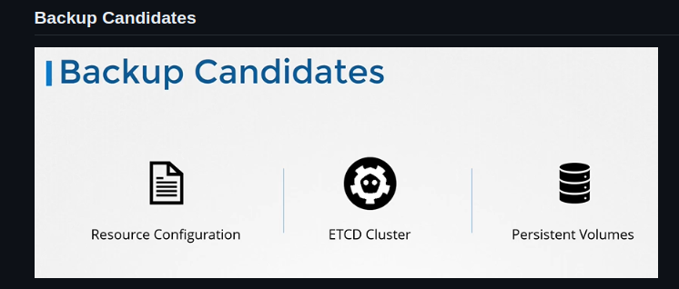

# Cluster Maintenance

## Monitor: Metrics Server

```shell
git clone https://github.com/kubernetes-incubator/metrics-server.git
kubectl create -f metric-server/deploy/1.8+/
kubectl top node
kubectl top pod
```

## OS Upgrades

```shell
kubectl drain node-1 # drain the node of all the workloads so that the workloads are moved to other nodes.
kubectl uncordon node-1 # When node backs online
kubectl cordon node-1 # Unlike drain it does not terminate or move the pods on an existing node.
```

## Cluster Upgrades (KubeAdm)

{ loading=lazy }

### Master

```shell
kubectl taint controlplane

vim /etc/apt/sources.list.d/kubernetes.list
# kubernetes.list File
deb [signed-by=/etc/apt/keyrings/kubernetes-apt-keyring.gpg] https://pkgs.k8s.io/core:/stable:/v1.29/deb/ /

apt update
apt-cache madison kubeadm
apt-get install -y kubeadm=1.12.0-00 # Upgrade kubeadm from v1.11 to v1.12

kubeadm upgrade plan
kubeadm upgrade apply v1.12.0
```

#### Upgrade Kubelet

```shell
apt-get upgrade kubelet=1.12.0-00
systemctl daemon-reload
systemctl restart kubelet

kubectl uncordon controlplane
```

### Workers

```shell
kubectl drain node-1

vim /etc/apt/sources.list.d/kubernetes.list
# kubernetes.list File
deb [signed-by=/etc/apt/keyrings/kubernetes-apt-keyring.gpg] https://pkgs.k8s.io/core:/stable:/v1.29/deb/ /
apt update
apt-cache madison kubeadm
apt-get upgrade -y kubeadm=1.12.0-00
kubeadm upgrade node

apt-get upgrade -y kubelet=1.12.0-00
systemctl daemon-reload
systemctl restart kubelet

kubectl uncordon node-1
```

## Backups

{ loading=lazy }

### Resource Configs

It's preferable via Declarative Way in Github. That is only for imperative way. You can only backup ETCD Cluster

```shell
kubectl get all --all-namespaces -o yaml > all-deploy-services.yaml (only for few resource groups)
```

### ETCD

```shell
ETCDCTL_API=3 etcdctl --endpoints=https://[127.0.0.1]:2379 \
--cacert=/etc/kubernetes/pki/etcd/ca.crt \
--cert=/etc/kubernetes/pki/etcd/server.crt \
--key=/etc/kubernetes/pki/etcd/server.key \
snapshot save snapshot.db

ETCDCTL_API=3 etcdctl snapshot status snapshot.db

# Restore Process
service kube-apiserver stop # First Stops Api Server. KubeAdm Deployments should be different (Also the others commands)

ETCDCTL_API=3 etcdctl snapshot restore --data-dir /var/lib/etcd-from-backup snapshot.db

# Update etcd-data volume on /etc/kubernetes/manifests/etcd.yaml

systemctl daemon-reload
service etcd restart
service kube-apiserver start

# Delete etcd pod if not goes to ready state
kubectl delete pod etcd-controlplane -n kube-system
```

## Private Registry

```shell
$ kubectl create secret docker-registry regcred \
  --docker-server=private-registry.io \ 
  --docker-username=registry-user \
  --docker-password=registry-password \
  --docker-email=registry-user@org.com
```