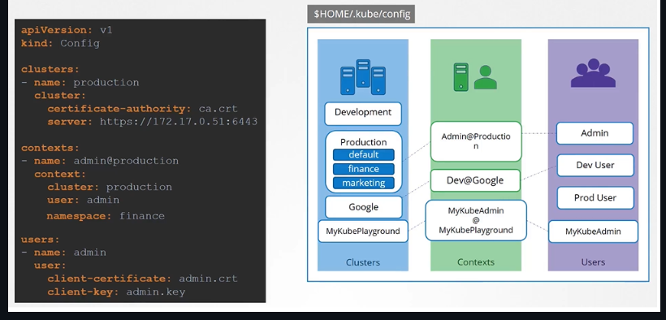

# Kubernetes Core Components

## ETCD

```shell
[etcd.service]
ExecStart=/usr/local/bin/etcd \\
--name ${ETCD_NAME} \\
--cert-file=/etc/etcd/kubernetes.pem \\
--key-file=/etc/etcd/kubernetes-key.pem \\
--peer-cert-file=/etc/etcd/kubernetes.pem \\
--peer-key-file=/etc/etcd/kubernetes-key.pem \\
--trusted-ca-file=/etc/etcd/ca.pem \\
--peer-trusted-ca-file=/etc/etcd/ca.pem \\
--peer-client-cert-auth \\
--client-cert-auth \\
--initial-advertise-peer-urls https://${INTERNAL_IP}:2380 \\
--listen-peer-urls https://${INTERNAL_IP}:2380 \\
--listen-client-urls https://${INTERNAL_IP}:2379,https://127.0.0.1:2379 \\
--advertise-client-urls https://${INTERNAL_IP}:2379 \\
--initial-cluster-token etcd-cluster-0 \\
--initial-cluster controller-0=https://${CONTROLLER0_IP}:2380,controller-1=https://${CONTROLLER1_IP}:2380 \\ # HA in Environment
--initial-cluster-state new \\
--data-dir=/var/lib/etcd
```

### Commands

```shell
./etcdctl set key1 value1
./etcdctl get key1
./etcdctl
```

## kube-apiserver

```shell
[kube-apiserver.service]
ExecStart=/usr/local/bin/kube-apiserver \\
--advertise-address=${INTERNAL_IP} \\
--allow-privileged=true \\
--apiserver-count=3 \\
--authorization-mode=Node,RBAC \\ # When specify multiple modes, it will authorize in the order in which it is specified
--bind-address=0.0.0.0 \\
--enable-admission-plugins=Initializers,NamespaceLifecycle,NodeRestriction,LimitRanger,ServiceAccount,DefaultStorageClass,ResourceQuota \\
--etcd-servers=https://127.0.0.1:2379 \\
--enable-swagger-ui=true \\
--event-ttl=1h \\
--experimental-encryption-provider-config=/var/lib/kubernetes/encryption-config.yaml \\
--runtime-config=api/all \\
--service-account-key-file=/var/lib/kubernetes/service-account.pem \\
--service-cluster-ip-range=10.32.0.0/24 \\
--service-node-port-range=30000-32767 \\
--basic-auth-file=filepassword \\ # Do Not Use. Use Certificates API instead or LDAP auth
--v=2
```
## kube-controller-manager

```shell
[kube-controller-manager.service]
ExecStart=/usr/local/bin/kube-controller-manager \\
--address=0.0.0.0 \\
--cluster-cidr=10.200.0.0/16 \\
--cluster-name=kubernetes \\
--cluster-signing-cert-file=/var/lib/kubernetes/ca.pem \\ # Is Used by Certification API
--cluster-signing-key-file=/var/lib/kubernetes/ca-key.pem \\ # Is Used by Certification API
--kubeconfig=/var/lib/kubernetes/kube-controller-manager.kubeconfig \\
--leader-elect=true \\
--root-ca-file=/var/lib/kubernetes/ca.pem \\
--service-account-private-key-file=/var/lib/kubernetes/service-account-key.pem \\
--service-cluster-ip-range=10.32.0.0/24 \\
--use-service-account-credentials=true \\
--v=2
```

## kube-scheduler

```shell
[kube-scheduler.service]
ExecStart=/usr/local/bin/kube-scheduler \\
--config=/etc/kubernetes/config/kube-scheduler.yaml \\
--v=2
```

## Kubelet

```shell
[kubelet.service]
ExecStart=/usr/local/bin/kubelet \\
--config=/var/lib/kubelet/kubelet-config.yaml \\
--container-runtime=remote \\
--container-runtime-endpoint=unix:///var/run/containerd/containerd.sock \\
--image-pull-progress-deadline=2m \\
--pod-manifest-path=/etc/kubernetes/manifests \\ # Static Pods
--kubeconfig=/var/lib/kubelet/kubeconfig \\
--network-plugin=cni \\
--register-node=true \\
--v=2
```

## kube-proxy

```shell
[kube-proxy.service]
ExecStart=/usr/local/bin/kube-proxy \\
--config=/var/lib/kube-proxy/kube-proxy-config.yaml
Restart=on-failure
RestartSec=5
```

## KubeConfig

{ loading=lazy }

```shell
kubectl config view
kubectl config view --kubeconfig=my-custom-config
kubectl config use-context <context-name> # Or kubectl config use-context prod-user@production
kubectl config set-context $(kubectl config current-context) --namespace=dev
```