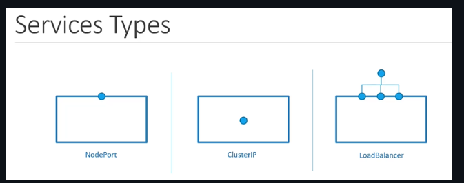

# Kubernetes Resources

## Pods

```yaml
apiVersion: v1
kind: Pod
metadata:
  name: myapp-prod
  labels:
    app: myapp
    type: front-end
spec:
  schedulerName: my-scheduler # To Use Custom Scheduler
  securityContext:
    runAsUser: 1000
  containers:
    - name: nginx-container
      image: nginx
      ports:
        - containerPort: 8080
      command: ["sleep"]
      args: ["10"]
      env:
        - name: APP_COLOR
          value: pink
        - name: APP_COLOR_2 # Inject ConfigMap as Single Environment Variable
          valueFrom:
            configMapKeyRef:
              name: app-config
              key: APP_COLOR
        - name: APP_COLOR_3 # Inject Secret as Single Environment Variable
          valueFrom:
            secretKeyRef:
              name: app-secret
              key: APP_COLOR
      envFrom:
        - configMapRef: # Inject ConfigMap as Environment
            name: app-config
        - secretRef: # Inject Secret as Environment
            name: app-secret
      resources:
        requests:
          memory: "1Gi"
          cpu: "1"
        limits:
          memory: "2Gi"
          cpu: "2"
      securityContext:
          runAsUser: 1000
          capabilities:
            add: ["MAC_ADMIN", "SYS_TIME"]
    - name: log-agent
      image: log-agent
  initContainers:
    - name: init-myservice
      image: busybox
      command: ['sh', '-c', 'git clone <some-repository-that-will-be-used-by-application> ; done;']
  imagePullSecrets: # To Configure Private Registry
    - name: regcred
  serviceAccountName: dashboard-sa
  automountServiceAccountToken: false # Deprecated. Not Necessary in latest versions
  volumes:
    - name: app-config-volume # Inject Config Map as a file in a Volume
      configMap:
        name: app-config
    - name: app-secret-volume # Inject Secret as a file in a Volume
      secret:
        secretName: app-secret
  tolerations: # Scheduling
  - key: "app"
    operator: "Equal"
    value: "blue"
    effect: "NoSchedule"
  nodeSelector: # Scheduling
    size: Large
  nodeName: node02 # Scheduling: Manual Scheduling
  affinity: # Scheduling
    nodeAffinity:
      requiredDuringSchedulingIgnoredDuringExecution:
        nodeSelectorTerms:
          - matchExpressions:
              - key: size
                operator: In
                values:
                  - Large
                  - Medium
```

## Services

{ loading=lazy }

### NodePort

```yaml
apiVersion: v1
kind: Service
metadata:
  name: myapp-service
spec:
  type: NodePort
  ports:
    - targetPort: 80
      port: 80
      nodePort: 30008
  selector:
    app: myapp
    type: front-end
```

### Cluster IP

```yaml
apiVersion: v1
kind: Service
metadata:
 name: back-end
spec:
 type: ClusterIP
 ports:
 - targetPort: 80
   port: 80
 selector:
   app: myapp
   type: back-end
```

## Deployments

```yaml
apiVersion: apps/v1
kind: Deployment
metadata:
  name: myapp-deployment
  labels:
    app: myapp
    type: front-end
spec:
 template:
   <POD YAML Template>
 replicas: 3
 selector:
   matchLabels:
    type: front-end
 strategy:
  type: RollingUpdate # Or Recreate
  rollingUpdate:
    maxUnavailable: 1
```

### Commands

```shell
kubectl rollout status deployment/myapp-deployment
kubectl rollout history deployment/myapp-deployment
kubectl rollout undo deployment/myapp-deployment
```

## DaemonSets

```yaml
apiVersion: apps/v1
kind: DaemonSet
metadata:
  name: monitoring-daemon
  labels:
    app: nginx
spec:
  selector:
    matchLabels:
      app: monitoring-agent
  template:
    <POD YAML Template>
```

## Network Policy

```yaml
apiVersion: networking.k8s.io/v1
kind: NetworkPolicy
metadata:
 name: db-policy
spec:
  podSelector:
    matchLabels:
      role: db
  policyTypes:
  - Ingress
  - Egress
  ingress:
  - from:
    - podSelector:
        matchLabels:
          name: api-pod
      namespaceSelector: # Its necessary label namespace
        matchLabels:
          name: prod
    - ipBlock: # To External access
        cidr: 192.168.5.10/32 
    ports:
    - protocol: TCP
      port: 3306
  egress:
    - to:
        - ipBlock:
            cidr: 192.168.5.10/32
      ports:
        - protocol: TCP
          port: 80
```

## RBAC

### Role

```yaml
apiVersion: rbac.authorization.k8s.io/v1
kind: Role
metadata:
  name: developer
rules:
- apiGroups: [""] # "" indicates the core API group
  resources: ["pods"]
  verbs: ["get", "list", "update", "delete", "create"]
  resourceNames: ["blue", "orange"] # Optional
- apiGroups: [""]
  resources: ["ConfigMap"]
  verbs: ["create"]
```

### Role Binding

```yaml
apiVersion: rbac.authorization.k8s.io/v1
kind: RoleBinding
metadata:
  name: devuser-developer-binding
subjects:
- kind: User # Or ServiceAccount
  name: dev-user # "name" is case sensitive
  apiGroup: rbac.authorization.k8s.io
roleRef:
  kind: Role
  name: developer
  apiGroup: rbac.authorization.k8s.io
```

### Cluster Role

```yaml
apiVersion: rbac.authorization.k8s.io/v1
kind: ClusterRole
metadata:
  name: cluster-administrator
rules:
- apiGroups: [""] # "" indicates the core API group
  resources: ["nodes"]
  verbs: ["get", "list", "delete", "create"]
```

### Cluster Role Binding

```yaml
apiVersion: rbac.authorization.k8s.io/v1
kind: ClusterRoleBinding
metadata:
  name: cluster-admin-role-binding
subjects:
- kind: User
  name: cluster-admin
  apiGroup: rbac.authorization.k8s.io
roleRef:
  kind: ClusterRole
  name: cluster-administrator
  apiGroup: rbac.authorization.k8s.io
```

## Namespaces

### Namespace

```yaml
apiVersion: v1
kind: Namespace
metadata:
  name: dev
```

### Resource Quota

```yaml
apiVersion: v1
kind: ResourceQuota
metadata:
  name: compute-quota
  namespace: dev
spec:
  hard:
    pods: "10"
    requests.cpu: "4"
    requests.memory: 5Gi
    limits.cpu: "10"
    limits.memory: 10Gi
```

## Replica Sets

```yaml
apiVersion: apps/v1
kind: ReplicaSet
metadata:
 name: myapp-replicaset
 labels:
   app: myapp
   type: front-end
spec:
 template:
   <POD YAML Template>
 replicas: 3
 selector:
   matchLabels:
     type: front-end
```

## Service Accounts

```shell
kubectl create token <sa-account-name>
kubectl create token <sa-account-name> # To create token
```