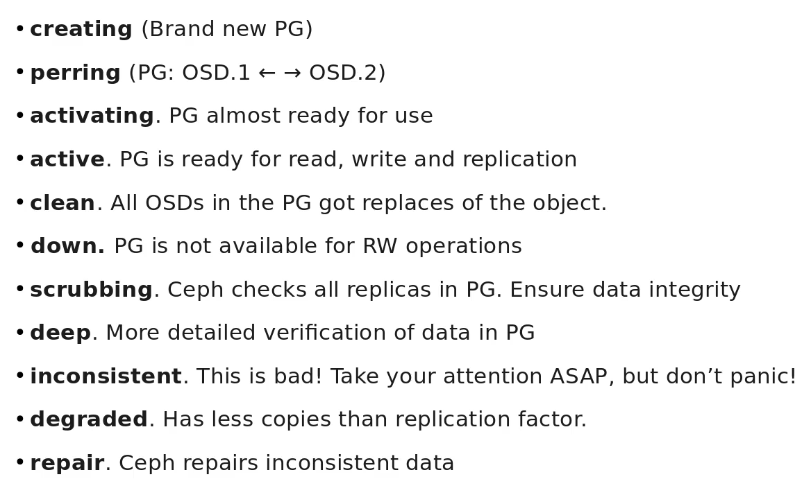
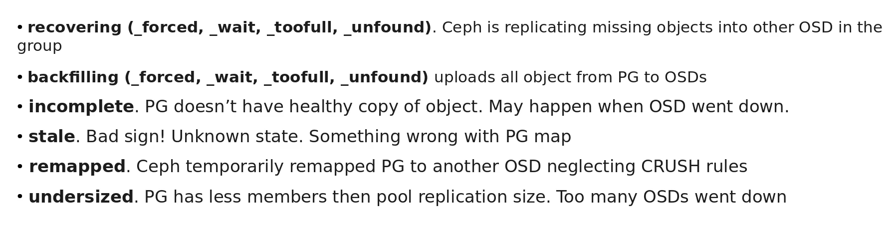

# Ceph

## Usefully Commands

```shell
ceph pgh dump pgs_brief # List Placement Groups

# Get Cluster Map
ceph mon getmap > /tmp/monmap
monmaptool --print /tmp/monmap

# OSD Map
ceph osd getmap > /tmp/osdmap
osdmaptool --print /tmp/osdmap

# Pre Compute the PG file will be stored
ceph osd map poolone test.txt

# Mount OSD as Filesystem
ceph osd set noout # Stop OSD first
ceph -s # To verify
systemctl stop ceph-osd@1.service
ceph osd tree
ceph-objectstore-tool --data-path /var/lib/ceph/osd/ceph-1 --op list
ceph-objectstore-tool --data-path /var/lib/ceph/osd/ceph-1 --op fuse --mountpoint /mnt & # Mount as fuse filesystem
ps ax | greph -i ceph-ob # Kill the process to stop mount as filesystem
systemctl start ceph-osd@1 # To restart osd process
```

## PG States

{ loading=lazy }
{ loading=lazy }

* rados commands - Interact with ceph storage

```shell
rados -p poolone put test.txt ./test.txt
rados -p poolone ls | grep -i test
rados -p poolone get test.txt fromceph # Get file from ceph. fromceph is file output
```