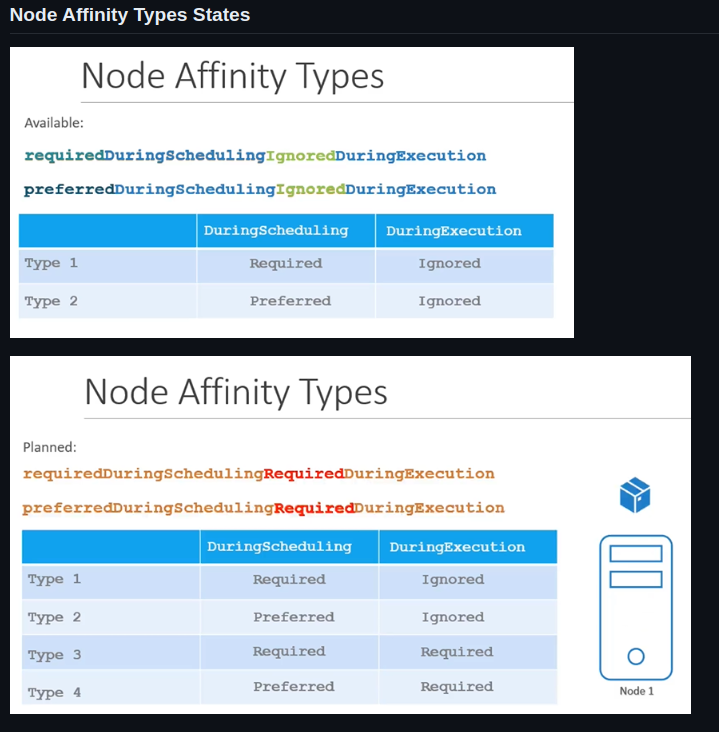
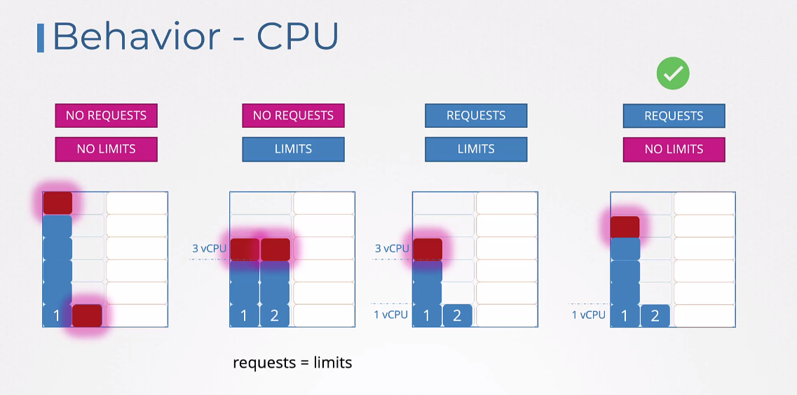
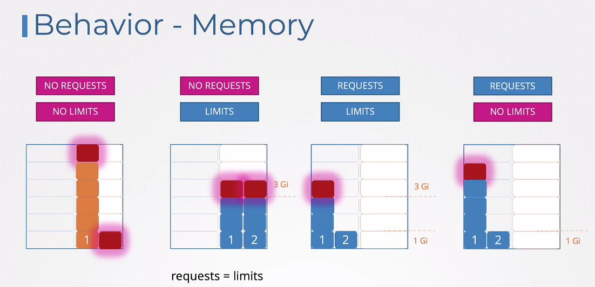
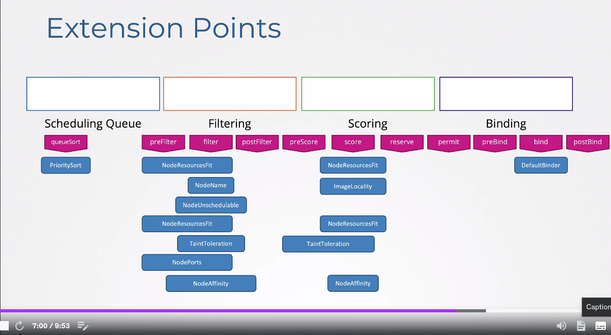

# Kubernetes Scheduling

## Taints and Tolerations

* There are 3 taint effects
    * NoSchedule
    * PreferNoSchedule
    * NoExecute

```shell
kubectl taint nodes <node-name> key=value:taint-effect
kubectl taint nodes node1 app=blue:NoSchedule
```

## Node Selectors and Node Affinity

{ loading=lazy }

```shell
kubectl label nodes <node-name> <label-key>=<label-value>
kubectl label nodes node-1 size=Large
```

## Resources Requests

{ loading=lazy }

{ loading=lazy }

## Scheduler Profiles

{ loading=lazy }

```yaml
apiVersion: kubescheduler.config.k8s.io/v1
kind: KubeSchedulerConfiguration
profiles:
  - schedulerName: my-scheduler
    plugins:
      score:
        disabled:
          - name: TaintToleration
        enabled:
          - name: MyCustomPluginA
          - name: MyCustomPluginB
  - schedulerName: my-scheduler-2
    plugins:
      preScore:
        disabled:
          - name: '*'
      score:
        disabled:
          - name: '*'
```

## Pod Binding

```yaml
apiVersion: v1
kind: Binding
metadata:
  name: nginx
target:
  apiVersion: v1
  kind: Node
  name: node02
```

### Create

* This file (Convert to JSON) needs to be sent via Curl

```shell
curl --header "Content-type: application/json" --request POST --data '{"apiVersion": "v1", "kind": "Binding", .... }' http://$SERVER/api/v1/namespaces/default/pods/$PODNAME/binding
```