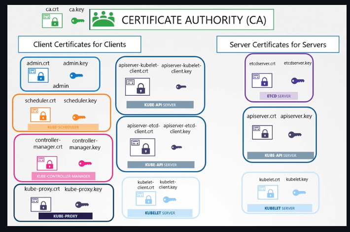

# Kubernetes Security

## Hosts

* Password based authentication disabled
* SSH Key based authentication

## Kubernetes

### Authentication

* Authentication Mechanisms
    * Static Password file
        * --basic-auth-file (KubeAPI Server Option)
        * Not Recommended
    * Static Token File
    * Certificates
    * Identity Services

### Authorization

#### Node Authorization

* Via TLS Certificate
    * Group: SYSTEM:NODES

#### Attribute-based Authorization (ABAC)

* Via Curl. One Policy Per User

```json
{
  "kind": "Policy",
  "spec": {
    "user": "dev-user",
    "namespace": "*",
    "resource": "pods",
    "apiGroup": "*"
  }
}
```

#### Role-Based Authorization (RBAC)

{ loading=lazy }

{ loading=lazy }

```shell
# List all the api groups
curl http://localhost:6443 -k
curl http://localhost:6443/apis -k | grep "name"
kubectl proxy # To do curls requests to api server without using certificates (Uses the Kube Config)
```

##### Check Access

```shell
kubectl auth can-i create deployments
kubectl auth can-i delete nodes

kubectl auth can-i create deployments --as dev-user
kubectl auth can-i create pods --as dev-user

kubectl auth can-i create pods --as dev-user --namespace test
```

#### Webhook

#### TLS Certificates

All communication with the cluster, between the various components such as the ETCD Cluster, kube-controller-manager, scheduler, api server, as well as those running on the working nodes such as the kubelet and kubeproxy is secured using TLS encryption.

{ loading=lazy }

[Certificates Tools](https://github.com/mmumshad/kubernetes-the-hard-way/tree/master/tools)

##### Certificates API (CertificateSigningRequest)

[Generate Certificates](https://github.com/kodekloudhub/certified-kubernetes-administrator-course/blob/master/docs/07-Security/07-TLS-in-Kubernetes-Certificate-Creation.md)

```yaml
apiVersion: certificates.k8s.io/v1
kind: CertificateSigningRequest
metadata:
  name: jane
spec:
  groups:
    - system:authenticated
  usages:
    - digital signature
    - key encipherment
    - server auth
    - client auth
  signerName: kubernetes.io/kube-apiserver-client
  request: <certificate-goes-here> # base64 encoded certificate
```

###### Commands

```shell
cat akshay.csr | base64 -w 0
kubectl create -f jane.yaml
kubectl get csr
kubectl certificate approve jane
kubectl get csr jane -o yaml
echo "<certificate>" | base64 --decode # To Decode it
```

### Network Policies

{ loading=lazy }

## Service Account

* Disable Auto Mount SA on default SA in SA Level

```shell
apiVersion: v1
kidn: ServiceAccount
metadata:
  name: custom-sa
automountServiceAccountToken: false
```

## RunTime Class

```yaml
apiVersion: node.k8s.io/v1
kind: RuntimeClass
metadata:
  name: gvisor
handler: runsc
```