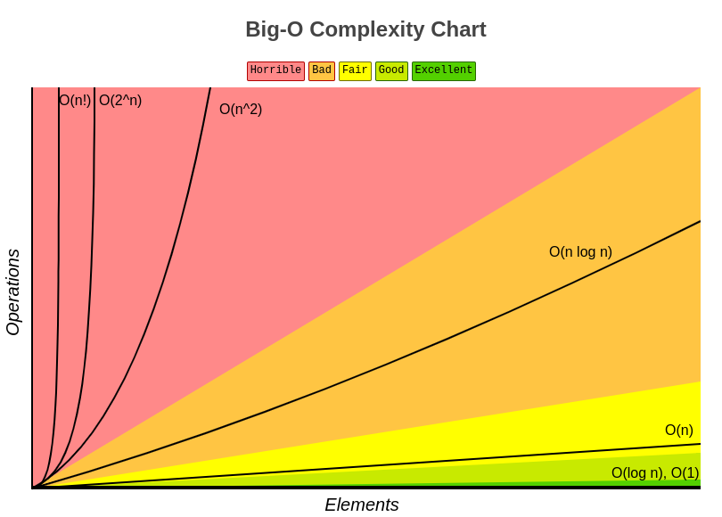
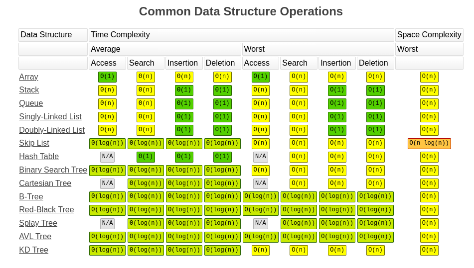
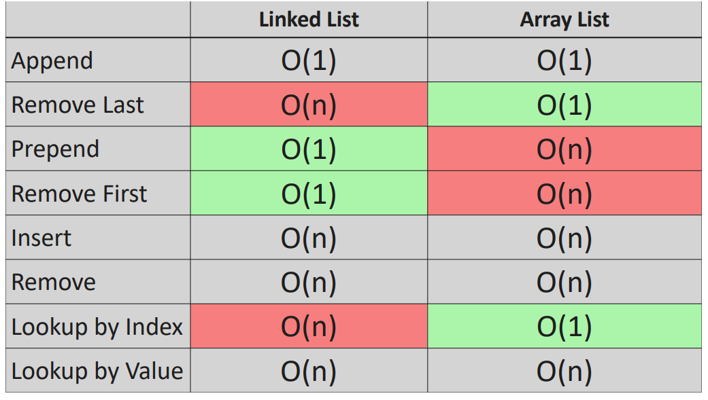
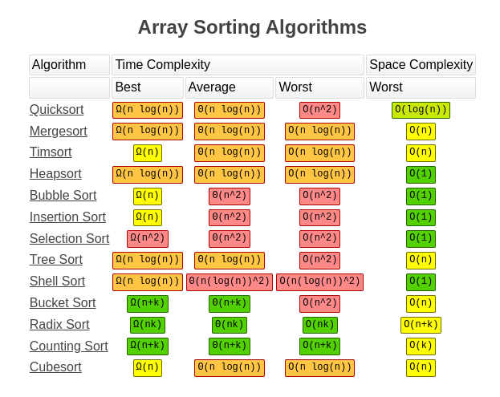

# Big O Notation

[Site](https://www.bigocheatsheet.com/)

## Big O Complexity

{ loading=lazy }

## Common Data Structure Operations

{ loading=lazy }

### Linked Lists

{ loading=lazy }

## Array Sorting Algorithms

{ loading=lazy }
