# Microsoft Bot Framework

## Activity

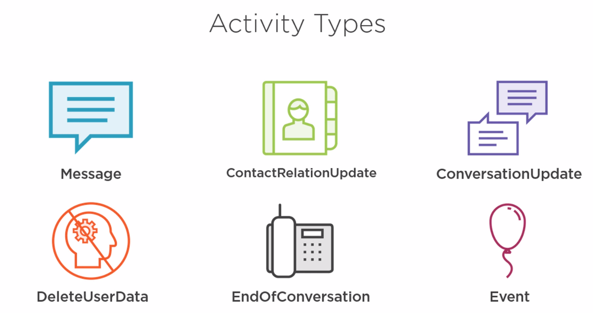{ loading=lazy }

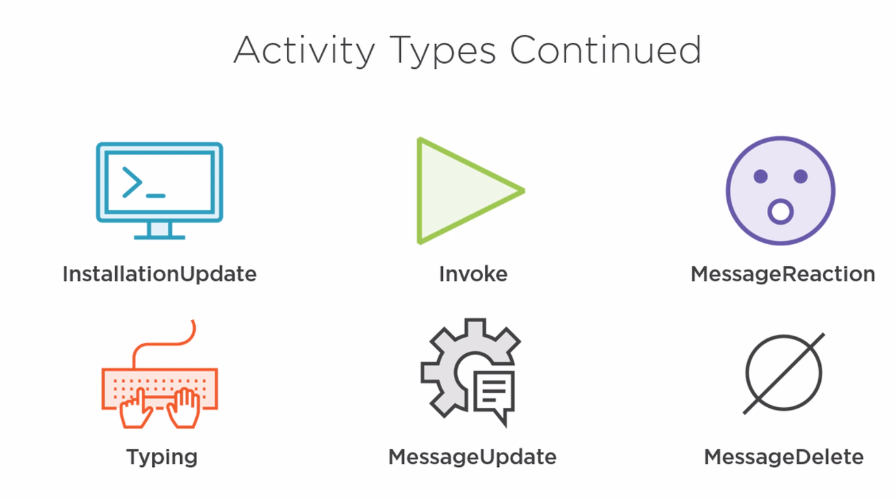{ loading=lazy }

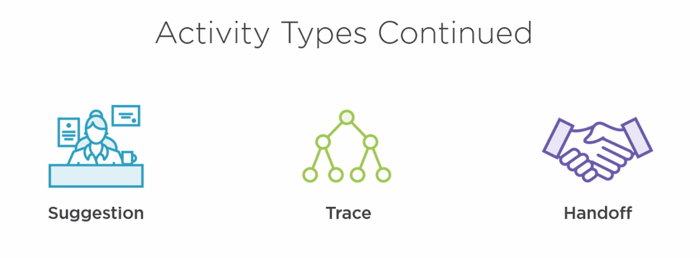{ loading=lazy }

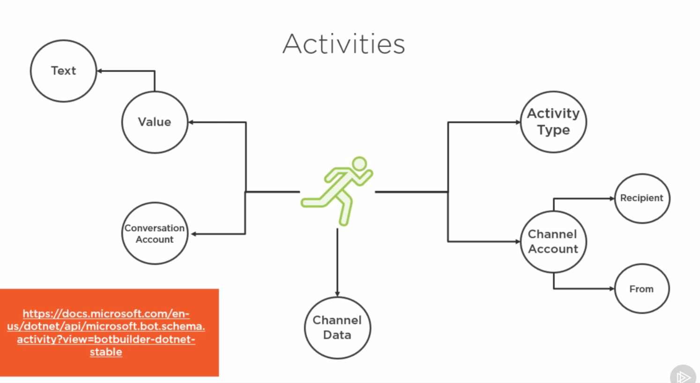{ loading=lazy }

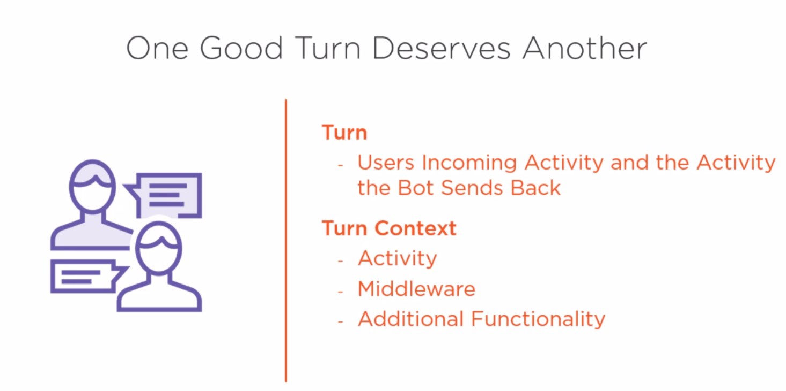{ loading=lazy }

## State Management

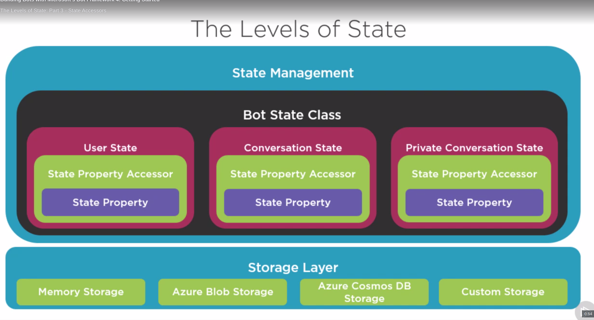{ loading=lazy }

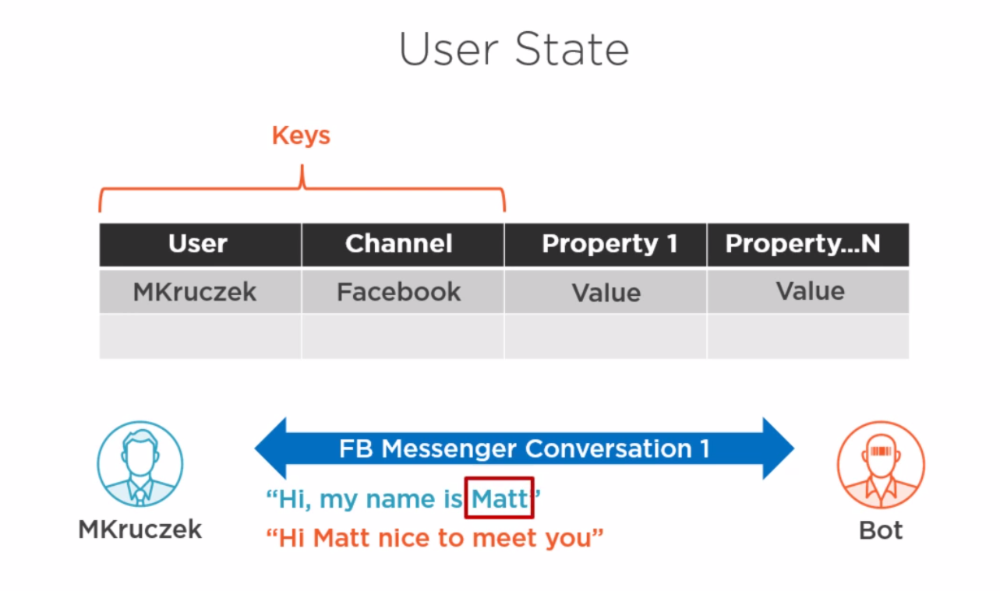{ loading=lazy }

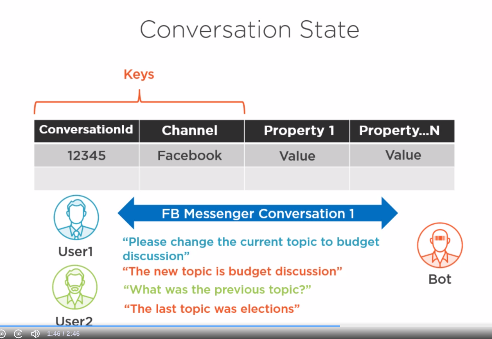{ loading=lazy }

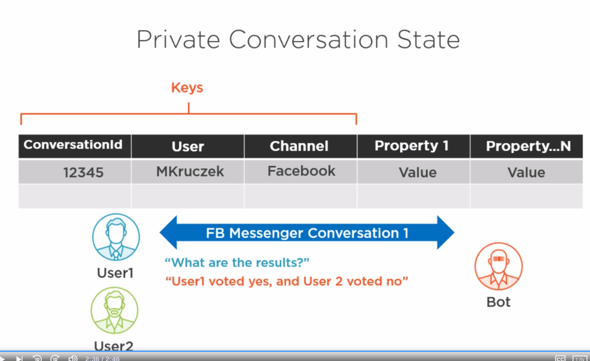{ loading=lazy }

## Dialogs

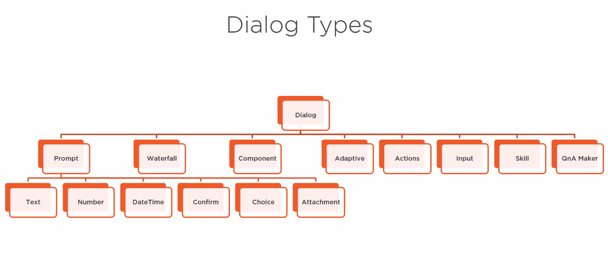{ loading=lazy }

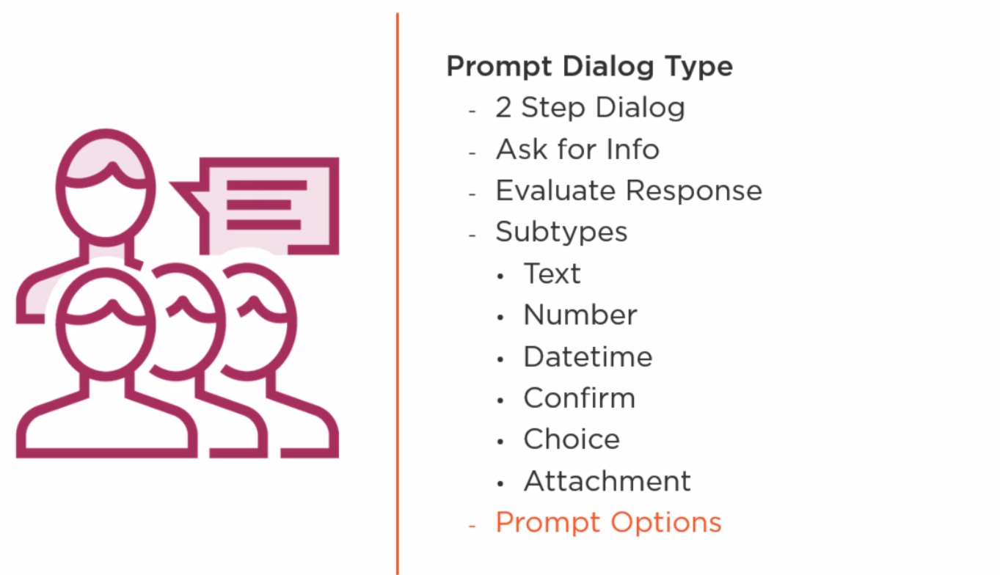{ loading=lazy }

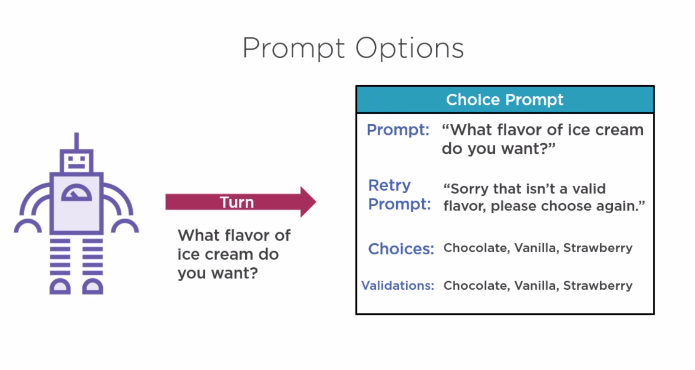{ loading=lazy }

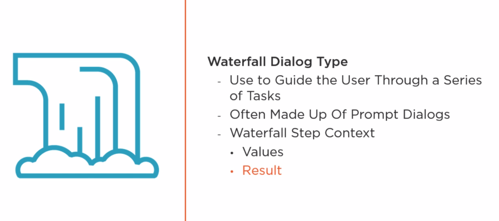{ loading=lazy }

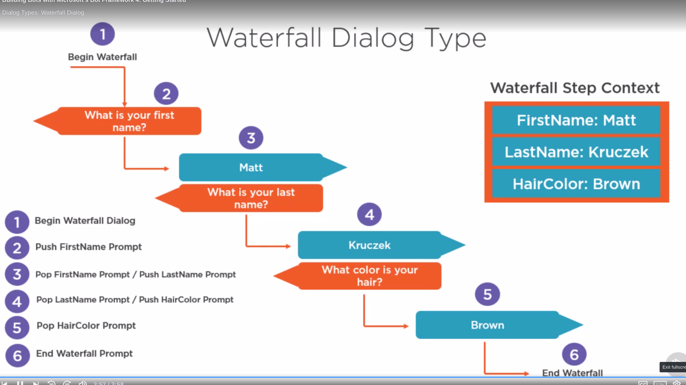{ loading=lazy }